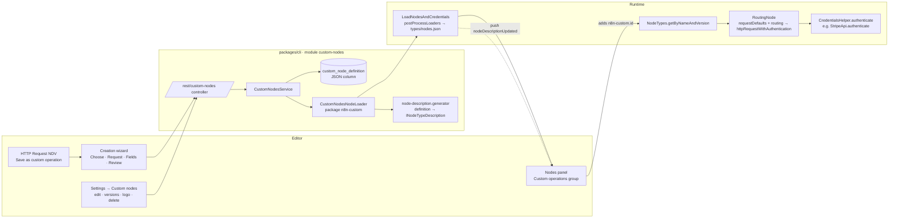

# Design: Custom Nodes & Custom Operations

Status: presentation mockup on branch `feat/custom-nodes-mockup`, behind
`N8N_CUSTOM_NODES_MOCKUP=true`. Not production code.

## Problem

Most APIs are far bigger than their n8n node. Stripe alone has hundreds of
endpoints; the Stripe node covers eight resources. The escape hatch is the
HTTP Request node, but that configuration is trapped inside one workflow:
no name, no icon, no typed parameters, no reuse, no central place to fix a
wrong header for the whole instance. Builders copy the same node between
workflows and every copy drifts.

The community has asked for this for years:

- [Convert a HTTP Request into a custom node](https://community.n8n.io/t/convert-a-http-request-into-a-custom-node/6980)
- The 2025 "Node Presets" / "Pre-configured Node Templates" threads, which
  ask for the same thing from the template angle: save a configured node
  and re-add it with one click.

## Two concepts, one schema

| | Custom Operation | Custom Node |
| --- | --- | --- |
| Belongs to | an existing node type (`n8n-nodes-base.stripe`) | itself |
| Appears | under the parent's actions, group **Custom operations**, parent icon | as a regular node with its own icon |
| Credential | the parent's predefined credential (`stripeApi`) | generic HTTP auth or any predefined type |
| Operations | exactly one | one or more |

Both are stored with the same `CustomOperationDefinition` document (see
`packages/@n8n/api-types/src/schemas/custom-nodes.schema.ts`). A Custom Node
is a `CustomNodeDefinition` that points at its operations. Operations carry
a version history and an `activeVersion`.

**Why both?** Operations cover the dominant case (extend Stripe) with zero
setup: the user never chooses an icon or an auth method because the parent
already has them. Custom Nodes cover the long tail of internal and niche
APIs. **Why operations first?** They reuse everything the parent node
already established, they are discoverable where users already look, and
they exercise the whole pipeline (definition → generated type → execution)
with the smallest UI.

## Architecture

1. **Definition** (JSON) is the source of truth. Versions are immutable;
   editing appends a version and moves `activeVersion`.
2. **Generator** turns each definition into declarative node descriptions.
   Fixed data (method, URL, baked-in headers/query/body) goes into
   `requestDefaults` (single operation) or the `routing.request` of the
   selected `operation` option (custom node). Each input carries a
   `routing.send` (body/query) or `routing.request.headers` (header) rule.
   URL placeholders become expressions on the URL. Required inputs are
   top-level parameters, optional inputs live in an *Additional Fields*
   collection. One description per stored version, `defaultVersion` set to
   the active one, so new nodes get the active version and existing nodes
   stay pinned to theirs.
3. **Loader** implements `NodeLoader` (the same contract the MCP registry
   module uses for its synthetic nodes) under the package name
   `n8n-custom`. After every write the service calls `loader.loadAll()`,
   `LoadNodesAndCredentials.postProcessLoaders()`, `releaseTypes()` and
   broadcasts `nodeDescriptionUpdated`. This is the community-package
   install path, so `types/nodes.json` and the frontend update without a
   restart.
4. **Execution** needs no new code. `NodeTypes.getByNameAndVersion` gives
   every description with `requestDefaults` a `RoutingNode`-backed
   `execute`. The declared credential's `authenticate` block adds the
   header, so a Stripe operation reuses the user's Stripe credential.
5. **Nodes panel**: generated operation types are `hidden` and carry a
   `customDefinition` marker naming the parent. `useActionsGeneration`
   pushes one action per marker into the parent's action list under the
   label *Custom operations*; the action's `name` is the generated type, so
   selecting it adds that type. Custom Nodes are not hidden and appear like
   any other node.

### Virtual node type vs. mutating the parent description

The mockup generates a separate node type per operation and only *presents*
it as a Stripe action. The alternative is to append an `operation` option
and its parameters to the real Stripe description at load time.

| | Virtual type (chosen) | Mutate parent |
| --- | --- | --- |
| Touches `nodes-base` | no | no code, but the served description changes |
| Versioning | native node versioning per operation | must invent per-option versioning |
| Node on canvas | own type, own `typeVersion` | looks like a Stripe node, `typeVersion` of Stripe |
| Export / source control | one type name per operation | Stripe workflows silently depend on instance-local options |
| Risk | panel integration is a small frontend patch | `displayOptions` collisions, translations, AI tool wrapping, HITL, `injectCustomApiCallOptions` all see foreign parameters |

The virtual type keeps the built-in node untouched and gives versioning for
free. The cost is that a custom operation on the canvas is technically not
a Stripe node (different `type`), which matters for search, telemetry and
"used in" counts. A production version could add a `parentNodeType` field
to the node description so those features can group them.

## What is mocked or hacked

- **Feature flag** is a module config read at boot; the module is a default
  module whose `init()`/`nodeLoaders()` return early when off.
- **No RBAC**: every authenticated user can create, edit and delete
  definitions. No project scoping; definitions are instance-wide.
- **Icons** are served from `GET /rest/custom-nodes/:id/icon` and
  referenced by a relative `iconUrl`. The `/icons/*` route only serves
  filesystem loaders.
- **Custom Node versioning** is not modelled: a custom node always uses the
  active version of each operation and is served as version 1.
- **Wizard** is a static preview (generated properties rendered as a list),
  not the real `ParameterInputList`. "Import cURL" reuses the existing
  `toHttpNodeParameters` converter.
- **Pre-fill heuristics**: expression-valued fields of the HTTP Request node
  become required inputs, literal fields stay fixed. Good enough for a demo,
  needs a real UI for mixed templates.
- **Multi-main / queue mode**: no pubsub fan-out; other main instances and
  workers only pick up new definitions on restart.
- **Used-in count** is not implemented.
- **Request Options** (batching, proxy, timeout) that `DirectoryLoader`
  injects into declarative nodes are not added.
- **Schema docs** (`docs/generated/`) were not regenerated (needs
  tbls/Docker). The DB Tests CI job will flag it.
- **Tests**: two unit tests for the generator; nothing for the service,
  controller or frontend.

## What a production version needs

- **Permissions and scoping**: scopes such as `customNode:create|update|delete`,
  project-owned definitions with sharing, and an "instance-wide" flag for
  admins. Credentials already follow this model.
- **Source control and export/import**: definitions must be part of the
  environments export (they are as much workflow dependencies as
  credentials). Workflow import should fail clearly when a `n8n-custom.*`
  type is missing, or carry the definition inline.
- **Credential handling**: for parents with several credential options
  (`authentication` parameter) the operation must pick one explicitly; the
  generator currently uses the first. OAuth2 parents work through
  `authenticate`, but token refresh edge cases need testing.
- **Versioning semantics**: pin per node (current), auto-upgrade for
  non-breaking changes, or a "migrate all workflows to v2" action. Deleting
  a version that is still in use must be blocked; "used in" needs a
  node-type index over workflows.
- **Export as node package**: the definition already is a declarative node.
  Emitting an `n8n-nodes-*` package (TypeScript files + `package.json`) is a
  mechanical transform and the natural graduation path to community nodes.
- **Cloud vs. self-hosted**: definitions are DB rows and generated types are
  in-memory, so cloud needs no filesystem access. Multi-main needs a pubsub
  reload command like `reload-mcp-registry`.
- **Type name stability**: today the type is `n8n-custom.<nanoid>`.
  Human-readable slugs are friendlier in JSON but need rename handling.
- **AI tools**: `usableAsTool: true` on generated descriptions would make
  every custom operation available to agents. Left out to keep the
  post-processing risk low in the mockup.
- **Tests**: generator property-based tests, service tests for versioning,
  Playwright coverage for the NDV → panel → run path.

## Verification done on this branch

- `pnpm build` (all 70 tasks), `pnpm typecheck` in `packages/cli` (only
  pre-existing errors in `modules/agents` and `modules/instance-ai` remain)
  and in `packages/frontend/editor-ui` (clean), eslint and biome on every
  touched file, and the generator unit tests.
- A throwaway instance (`N8N_USER_FOLDER` in a temp dir,
  `N8N_CUSTOM_NODES_MOCKUP=true`) booted, ran the new migration, seeded the
  two examples and served two `n8n-custom.*` types with the expected marker,
  icon and credentials. Through REST: preview, create operation, new version
  (both versions served, `defaultVersion` follows the active one), set active
  version, icon route, and a manual run of a workflow containing a custom
  Stripe operation against the mock webhook workflow. The mock received
  `Authorization: Bearer <stripe key>` and the form-encoded body
  `line_items[0][price]`, `line_items[0][quantity]`,
  `line_items[0][adjustable_quantity][enabled]`.
- Not exercised: the editor UI (wizard, settings page, nodes panel group,
  NDV/header buttons). It typechecks and lints, but walk through `DEMO.md`
  once before presenting.

## Deviations from the brief

- Editor paths in the brief (`packages/editor-ui`, `src/views`,
  `src/components/Node/NodeCreator`) no longer exist; the code lives in
  `packages/frontend/editor-ui/src/app` and `src/features`.
- The brief suggested one REST controller with update "creates a new
  version". Implemented as `PATCH /custom-nodes/operations/:id` (a `version`
  payload appends a version) plus `POST /custom-nodes/nodes` for custom
  nodes, because the two kinds have different DTOs. A `POST /preview`
  endpoint was added so the wizard's review step shows the real generated
  parameters.
- MySQL migrations do not exist any more; the migration is a single
  `common/` file covering SQLite and Postgres.
- The settings sidebar entry is added directly in `useSettingsItems.ts`
  (gated by the flag) so it sits next to Community Nodes; module-provided
  items are appended at the end of the list.
- `INodeTypeBaseDescription` in `n8n-workflow` gained an optional
  `customDefinition` marker. The alternative (encoding the parent in
  `codex`) was rejected as a worse hack.
- Custom Node "operations" are options of one `operation` parameter, not
  separate node types, so a custom node's actions list works with the
  existing `operationsCategory` logic.

## Open questions for the team

1. Should a custom operation on the canvas be a Stripe node (`type:
   n8n-nodes-base.stripe`) or its own type? The virtual type is cleaner
   technically; product may prefer "it is just a Stripe node".
2. Who may create instance-wide operations? Members, project admins, or
   owners only? Where do project-scoped definitions show in the panel?
3. Version policy: is "new nodes get the active version, old nodes stay
   pinned" the right default, or should non-breaking edits (renames,
   descriptions) auto-apply?
4. Should the wizard produce a `Custom API Call`-style HTTP Request node as
   a fallback when the request cannot be expressed declaratively (streams,
   pagination, binary uploads)?
5. Do we want the "export as community node package" path soon enough that
   the definition schema should mirror `INodeTypeDescription` more closely?
6. Telemetry: how do we count usage of custom operations per parent node to
   learn which built-in operations are missing?
