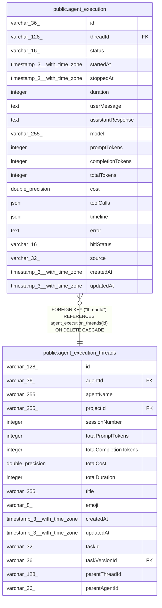

# public.agent_execution

## Columns

| Name | Type | Default | Nullable | Children | Parents | Comment |
| ---- | ---- | ------- | -------- | -------- | ------- | ------- |
| id | varchar(36) |  | false |  |  |  |
| threadId | varchar(128) |  | false |  | [public.agent_execution_threads](public.agent_execution_threads.md) |  |
| status | varchar(16) |  | false |  |  |  |
| startedAt | timestamp(3) with time zone |  | true |  |  |  |
| stoppedAt | timestamp(3) with time zone |  | true |  |  |  |
| duration | integer | 0 | false |  |  |  |
| userMessage | text |  | false |  |  |  |
| assistantResponse | text |  | false |  |  |  |
| model | varchar(255) |  | true |  |  |  |
| promptTokens | integer |  | true |  |  |  |
| completionTokens | integer |  | true |  |  |  |
| totalTokens | integer |  | true |  |  |  |
| cost | double precision |  | true |  |  |  |
| toolCalls | json |  | true |  |  |  |
| timeline | json |  | true |  |  |  |
| error | text |  | true |  |  |  |
| hitlStatus | varchar(16) |  | true |  |  |  |
| source | varchar(32) |  | true |  |  |  |
| createdAt | timestamp(3) with time zone | CURRENT_TIMESTAMP(3) | false |  |  |  |
| updatedAt | timestamp(3) with time zone | CURRENT_TIMESTAMP(3) | false |  |  |  |

## Constraints

| Name | Type | Definition |
| ---- | ---- | ---------- |
| CHK_agent_execution_hitlStatus | CHECK | CHECK ((("hitlStatus")::text = ANY ((ARRAY['suspended'::character varying, 'resumed'::character varying])::text[]))) |
| CHK_agent_execution_status | CHECK | CHECK (((status)::text = ANY ((ARRAY['success'::character varying, 'error'::character varying])::text[]))) |
| agent_execution_assistantResponse_not_null | n | NOT NULL "assistantResponse" |
| agent_execution_createdAt_not_null | n | NOT NULL "createdAt" |
| agent_execution_duration_not_null | n | NOT NULL duration |
| agent_execution_id_not_null | n | NOT NULL id |
| agent_execution_status_not_null | n | NOT NULL status |
| agent_execution_threadId_not_null | n | NOT NULL "threadId" |
| agent_execution_updatedAt_not_null | n | NOT NULL "updatedAt" |
| agent_execution_userMessage_not_null | n | NOT NULL "userMessage" |
| PK_ba438acc8532addc12d1ef17049 | PRIMARY KEY | PRIMARY KEY (id) |
| FK_add2432fb6034cc18b6af299dce | FOREIGN KEY | FOREIGN KEY ("threadId") REFERENCES agent_execution_threads(id) ON DELETE CASCADE |

## Indexes

| Name | Definition |
| ---- | ---------- |
| PK_ba438acc8532addc12d1ef17049 | CREATE UNIQUE INDEX "PK_ba438acc8532addc12d1ef17049" ON public.agent_execution USING btree (id) |
| IDX_63d3c3a68b9cebf05f967f0b1c | CREATE INDEX "IDX_63d3c3a68b9cebf05f967f0b1c" ON public.agent_execution USING btree ("threadId", "createdAt") |

## Relations

---

> Generated by [tbls](https://github.com/k1LoW/tbls)
