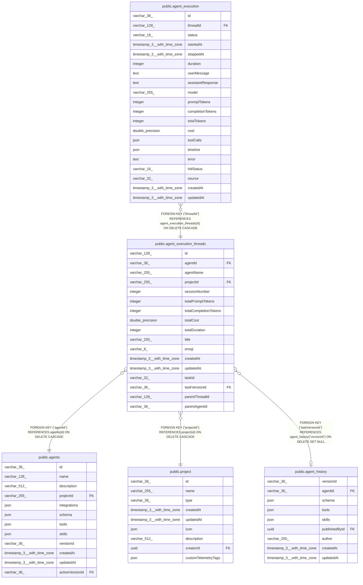

# public.agent_execution_threads

## Columns

| Name | Type | Default | Nullable | Children | Parents | Comment |
| ---- | ---- | ------- | -------- | -------- | ------- | ------- |
| id | varchar(128) |  | false | [public.agent_execution](public.agent_execution.md) |  |  |
| agentId | varchar(36) |  | false |  | [public.agents](public.agents.md) |  |
| agentName | varchar(255) |  | false |  |  |  |
| projectId | varchar(255) |  | false |  | [public.project](public.project.md) |  |
| sessionNumber | integer | 0 | false |  |  |  |
| totalPromptTokens | integer | 0 | false |  |  |  |
| totalCompletionTokens | integer | 0 | false |  |  |  |
| totalCost | double precision | 0 | false |  |  |  |
| totalDuration | integer | 0 | false |  |  |  |
| title | varchar(255) |  | true |  |  |  |
| emoji | varchar(8) |  | true |  |  |  |
| createdAt | timestamp(3) with time zone | CURRENT_TIMESTAMP(3) | false |  |  |  |
| updatedAt | timestamp(3) with time zone | CURRENT_TIMESTAMP(3) | false |  |  |  |
| taskId | varchar(32) |  | true |  |  | Published task ID that triggered this session; not an FK because published runs can outlive draft task definition rows |
| taskVersionId | varchar(36) |  | true |  | [public.agent_history](public.agent_history.md) | Published agent_history version that supplied the task snapshot |
| parentThreadId | varchar(128) |  | true |  |  | Parent session thread id that delegated this subagent run. |
| parentAgentId | varchar(36) |  | true |  |  | Saved agent id of the parent that delegated this subagent run. |

## Constraints

| Name | Type | Definition |
| ---- | ---- | ---------- |
| agent_execution_threads_agentId_not_null | n | NOT NULL "agentId" |
| agent_execution_threads_agentName_not_null | n | NOT NULL "agentName" |
| agent_execution_threads_createdAt_not_null | n | NOT NULL "createdAt" |
| agent_execution_threads_id_not_null | n | NOT NULL id |
| agent_execution_threads_projectId_not_null | n | NOT NULL "projectId" |
| agent_execution_threads_sessionNumber_not_null | n | NOT NULL "sessionNumber" |
| agent_execution_threads_totalCompletionTokens_not_null | n | NOT NULL "totalCompletionTokens" |
| agent_execution_threads_totalCost_not_null | n | NOT NULL "totalCost" |
| agent_execution_threads_totalDuration_not_null | n | NOT NULL "totalDuration" |
| agent_execution_threads_totalPromptTokens_not_null | n | NOT NULL "totalPromptTokens" |
| agent_execution_threads_updatedAt_not_null | n | NOT NULL "updatedAt" |
| FK_0e2f8bf92a7a9c88b89670f701c | FOREIGN KEY | FOREIGN KEY ("projectId") REFERENCES project(id) ON DELETE CASCADE |
| FK_0468a9dc35597314e641d4722aa | FOREIGN KEY | FOREIGN KEY ("agentId") REFERENCES agents(id) ON DELETE CASCADE |
| FK_f00b52d74fe11838e1fe086deea | FOREIGN KEY | FOREIGN KEY ("taskVersionId") REFERENCES agent_history("versionId") ON DELETE SET NULL |
| PK_22373dbf6ba6929d8ac50093309 | PRIMARY KEY | PRIMARY KEY (id) |

## Indexes

| Name | Definition |
| ---- | ---------- |
| IDX_0468a9dc35597314e641d4722a | CREATE INDEX "IDX_0468a9dc35597314e641d4722a" ON public.agent_execution_threads USING btree ("agentId") |
| IDX_0e2f8bf92a7a9c88b89670f701 | CREATE INDEX "IDX_0e2f8bf92a7a9c88b89670f701" ON public.agent_execution_threads USING btree ("projectId") |
| IDX_agent_execution_threads_taskVersionId | CREATE INDEX "IDX_agent_execution_threads_taskVersionId" ON public.agent_execution_threads USING btree ("taskVersionId") |
| PK_22373dbf6ba6929d8ac50093309 | CREATE UNIQUE INDEX "PK_22373dbf6ba6929d8ac50093309" ON public.agent_execution_threads USING btree (id) |

## Relations

---

> Generated by [tbls](https://github.com/k1LoW/tbls)
