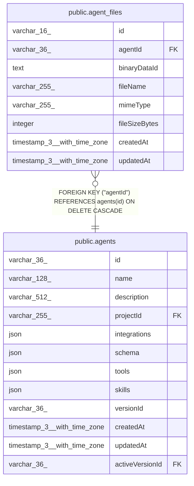

# public.agent_files

## Columns

| Name | Type | Default | Nullable | Children | Parents | Comment |
| ---- | ---- | ------- | -------- | -------- | ------- | ------- |
| id | varchar(16) |  | false |  |  | Application-generated n8n nano ID |
| agentId | varchar(36) |  | false |  | [public.agents](public.agents.md) | Agent that owns this uploaded file |
| binaryDataId | text |  | false |  |  | Opaque BinaryDataService reference (mode-prefixed, e.g. "filesystem-v2:\<uuid\>"); not an FK to binary_data, which only has rows in DB storage mode |
| fileName | varchar(255) |  | false |  |  |  |
| mimeType | varchar(255) |  | false |  |  |  |
| fileSizeBytes | integer |  | false |  |  | Uploaded file size in bytes |
| createdAt | timestamp(3) with time zone | CURRENT_TIMESTAMP(3) | false |  |  |  |
| updatedAt | timestamp(3) with time zone | CURRENT_TIMESTAMP(3) | false |  |  |  |

## Constraints

| Name | Type | Definition |
| ---- | ---- | ---------- |
| agent_files_agentId_not_null | n | NOT NULL "agentId" |
| agent_files_binaryDataId_not_null | n | NOT NULL "binaryDataId" |
| agent_files_createdAt_not_null | n | NOT NULL "createdAt" |
| agent_files_fileName_not_null | n | NOT NULL "fileName" |
| agent_files_fileSizeBytes_not_null | n | NOT NULL "fileSizeBytes" |
| agent_files_id_not_null | n | NOT NULL id |
| agent_files_mimeType_not_null | n | NOT NULL "mimeType" |
| agent_files_updatedAt_not_null | n | NOT NULL "updatedAt" |
| FK_aca4514cb500494b64356c2e164 | FOREIGN KEY | FOREIGN KEY ("agentId") REFERENCES agents(id) ON DELETE CASCADE |
| PK_692920e59217af7d124cd95106f | PRIMARY KEY | PRIMARY KEY (id) |

## Indexes

| Name | Definition |
| ---- | ---------- |
| PK_692920e59217af7d124cd95106f | CREATE UNIQUE INDEX "PK_692920e59217af7d124cd95106f" ON public.agent_files USING btree (id) |
| IDX_45dafc48fe2ce95eac30fc8ffd | CREATE INDEX "IDX_45dafc48fe2ce95eac30fc8ffd" ON public.agent_files USING btree ("agentId", "createdAt") |

## Relations

---

> Generated by [tbls](https://github.com/k1LoW/tbls)
