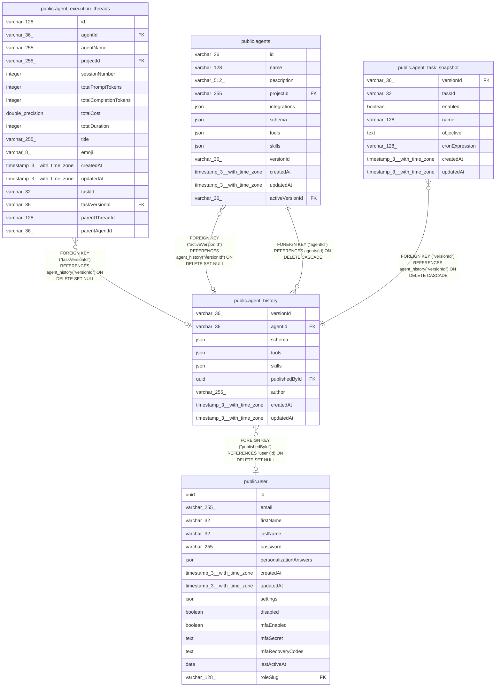

# public.agent_history

## Columns

| Name | Type | Default | Nullable | Children | Parents | Comment |
| ---- | ---- | ------- | -------- | -------- | ------- | ------- |
| versionId | varchar(36) |  | false | [public.agents](public.agents.md) [public.agent_execution_threads](public.agent_execution_threads.md) [public.agent_task_snapshot](public.agent_task_snapshot.md) |  |  |
| agentId | varchar(36) |  | false |  | [public.agents](public.agents.md) |  |
| schema | json |  | true |  |  | Frozen snapshot of the published AgentJsonConfig |
| tools | json |  | true |  |  | Frozen map of `toolId → { code, descriptor }` at publish time |
| skills | json |  | true |  |  | Frozen map of `skillId → AgentSkill` at publish time |
| publishedById | uuid |  | true |  | [public.user](public.user.md) |  |
| author | varchar(255) |  | false |  |  |  |
| createdAt | timestamp(3) with time zone | CURRENT_TIMESTAMP(3) | false |  |  |  |
| updatedAt | timestamp(3) with time zone | CURRENT_TIMESTAMP(3) | false |  |  |  |

## Constraints

| Name | Type | Definition |
| ---- | ---- | ---------- |
| agent_history_agentId_not_null | n | NOT NULL "agentId" |
| agent_history_author_not_null | n | NOT NULL author |
| agent_history_createdAt_not_null | n | NOT NULL "createdAt" |
| agent_history_updatedAt_not_null | n | NOT NULL "updatedAt" |
| agent_history_versionId_not_null | n | NOT NULL "versionId" |
| FK_8771675f44c58fb40e0feb9ee35 | FOREIGN KEY | FOREIGN KEY ("publishedById") REFERENCES "user"(id) ON DELETE SET NULL |
| FK_87cd5a8da20304b089ea2f83fec | FOREIGN KEY | FOREIGN KEY ("agentId") REFERENCES agents(id) ON DELETE CASCADE |
| PK_65ffcfe7a8e112fb826311fb092 | PRIMARY KEY | PRIMARY KEY ("versionId") |

## Indexes

| Name | Definition |
| ---- | ---------- |
| PK_65ffcfe7a8e112fb826311fb092 | CREATE UNIQUE INDEX "PK_65ffcfe7a8e112fb826311fb092" ON public.agent_history USING btree ("versionId") |
| IDX_87cd5a8da20304b089ea2f83fe | CREATE INDEX "IDX_87cd5a8da20304b089ea2f83fe" ON public.agent_history USING btree ("agentId") |

## Relations

---

> Generated by [tbls](https://github.com/k1LoW/tbls)
