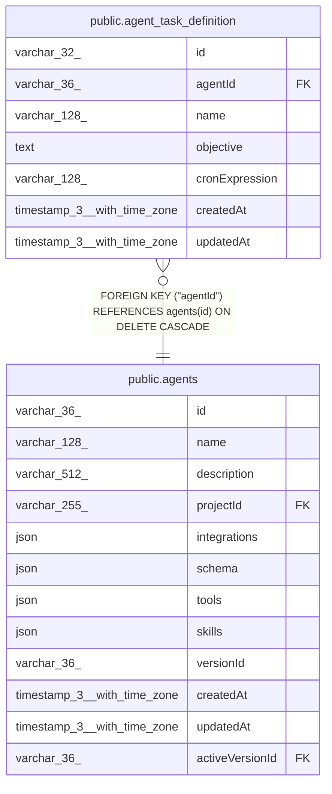

# public.agent_task_definition

## Columns

| Name | Type | Default | Nullable | Children | Parents | Comment |
| ---- | ---- | ------- | -------- | -------- | ------- | ------- |
| id | varchar(32) |  | false |  |  | Application-generated task ID referenced from agent JSON config |
| agentId | varchar(36) |  | false |  | [public.agents](public.agents.md) | Owning agent; task definitions are deleted when the agent is deleted |
| name | varchar(128) |  | false |  |  |  |
| objective | text |  | false |  |  | User-authored instruction sent to the agent when this task runs |
| cronExpression | varchar(128) |  | false |  |  | Cron schedule evaluated using the instance timezone |
| createdAt | timestamp(3) with time zone | CURRENT_TIMESTAMP(3) | false |  |  |  |
| updatedAt | timestamp(3) with time zone | CURRENT_TIMESTAMP(3) | false |  |  |  |

## Constraints

| Name | Type | Definition |
| ---- | ---- | ---------- |
| agent_task_definition_agentId_not_null | n | NOT NULL "agentId" |
| agent_task_definition_createdAt_not_null | n | NOT NULL "createdAt" |
| agent_task_definition_cronExpression_not_null | n | NOT NULL "cronExpression" |
| agent_task_definition_id_not_null | n | NOT NULL id |
| agent_task_definition_name_not_null | n | NOT NULL name |
| agent_task_definition_objective_not_null | n | NOT NULL objective |
| agent_task_definition_updatedAt_not_null | n | NOT NULL "updatedAt" |
| FK_f45d0535a2ed59b6c2dd6da98a0 | FOREIGN KEY | FOREIGN KEY ("agentId") REFERENCES agents(id) ON DELETE CASCADE |
| PK_1756c11c637903e97629a7a784a | PRIMARY KEY | PRIMARY KEY (id) |

## Indexes

| Name | Definition |
| ---- | ---------- |
| PK_1756c11c637903e97629a7a784a | CREATE UNIQUE INDEX "PK_1756c11c637903e97629a7a784a" ON public.agent_task_definition USING btree (id) |
| IDX_f45d0535a2ed59b6c2dd6da98a | CREATE INDEX "IDX_f45d0535a2ed59b6c2dd6da98a" ON public.agent_task_definition USING btree ("agentId") |

## Relations

---

> Generated by [tbls](https://github.com/k1LoW/tbls)
