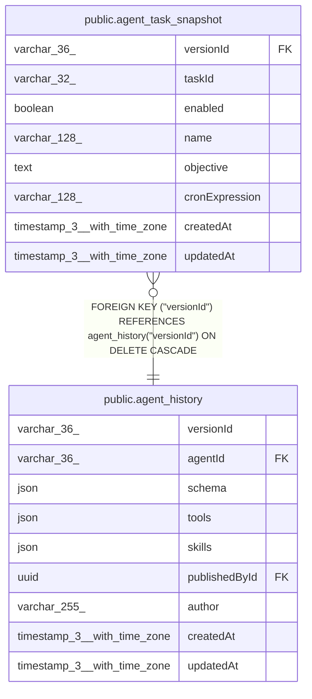

# public.agent_task_snapshot

## Columns

| Name | Type | Default | Nullable | Children | Parents | Comment |
| ---- | ---- | ------- | -------- | -------- | ------- | ------- |
| versionId | varchar(36) |  | false |  | [public.agent_history](public.agent_history.md) | Published agent_history version this task snapshot belongs to |
| taskId | varchar(32) |  | false |  |  | Stable task ID referenced from the published agent JSON config |
| enabled | boolean |  | false |  |  | Published enabled state for this task at publish time |
| name | varchar(128) |  | false |  |  |  |
| objective | text |  | false |  |  | User-authored instruction sent to the agent when this task runs |
| cronExpression | varchar(128) |  | false |  |  | Cron schedule evaluated using the instance timezone |
| createdAt | timestamp(3) with time zone | CURRENT_TIMESTAMP(3) | false |  |  |  |
| updatedAt | timestamp(3) with time zone | CURRENT_TIMESTAMP(3) | false |  |  |  |

## Constraints

| Name | Type | Definition |
| ---- | ---- | ---------- |
| agent_task_snapshot_createdAt_not_null | n | NOT NULL "createdAt" |
| agent_task_snapshot_cronExpression_not_null | n | NOT NULL "cronExpression" |
| agent_task_snapshot_enabled_not_null | n | NOT NULL enabled |
| agent_task_snapshot_name_not_null | n | NOT NULL name |
| agent_task_snapshot_objective_not_null | n | NOT NULL objective |
| agent_task_snapshot_taskId_not_null | n | NOT NULL "taskId" |
| agent_task_snapshot_updatedAt_not_null | n | NOT NULL "updatedAt" |
| agent_task_snapshot_versionId_not_null | n | NOT NULL "versionId" |
| FK_1acedce6690392ef1611cca8b88 | FOREIGN KEY | FOREIGN KEY ("versionId") REFERENCES agent_history("versionId") ON DELETE CASCADE |
| PK_2142a8bcda2360c3c5e34f82640 | PRIMARY KEY | PRIMARY KEY ("versionId", "taskId") |

## Indexes

| Name | Definition |
| ---- | ---------- |
| PK_2142a8bcda2360c3c5e34f82640 | CREATE UNIQUE INDEX "PK_2142a8bcda2360c3c5e34f82640" ON public.agent_task_snapshot USING btree ("versionId", "taskId") |

## Relations

---

> Generated by [tbls](https://github.com/k1LoW/tbls)
