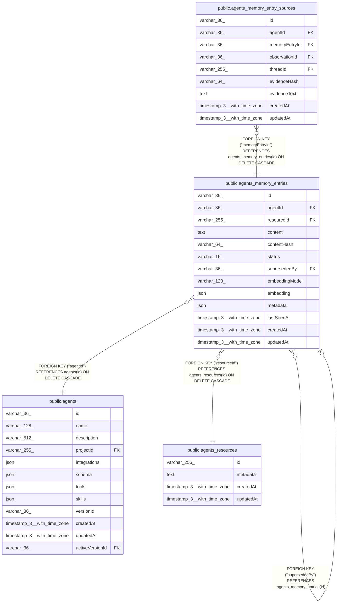

# public.agents_memory_entries

## Columns

| Name | Type | Default | Nullable | Children | Parents | Comment |
| ---- | ---- | ------- | -------- | -------- | ------- | ------- |
| id | varchar(36) |  | false | [public.agents_memory_entries](public.agents_memory_entries.md) [public.agents_memory_entry_sources](public.agents_memory_entry_sources.md) |  |  |
| agentId | varchar(36) |  | false |  | [public.agents](public.agents.md) | Agent that owns this episodic memory entry |
| resourceId | varchar(255) |  | false |  | [public.agents_resources](public.agents_resources.md) | agents_resources.id partition used for episodic recall scope |
| content | text |  | false |  |  |  |
| contentHash | varchar(64) |  | false |  |  |  |
| status | varchar(16) |  | false |  |  |  |
| supersededBy | varchar(36) |  | true |  | [public.agents_memory_entries](public.agents_memory_entries.md) | Self-reference to replacement memory entry |
| embeddingModel | varchar(128) |  | true |  |  | Embedding model used to produce embedding |
| embedding | json |  | true |  |  | Embedding vector for episodic recall |
| metadata | json |  | true |  |  | Optional system metadata for ranking and debugging |
| lastSeenAt | timestamp(3) with time zone |  | false |  |  | Last time equivalent content was observed; updatedAt tracks row mutation time |
| createdAt | timestamp(3) with time zone | CURRENT_TIMESTAMP(3) | false |  |  |  |
| updatedAt | timestamp(3) with time zone | CURRENT_TIMESTAMP(3) | false |  |  |  |

## Constraints

| Name | Type | Definition |
| ---- | ---- | ---------- |
| CHK_agents_memory_entries_status | CHECK | CHECK (((status)::text = ANY ((ARRAY['active'::character varying, 'superseded'::character varying, 'dropped'::character varying])::text[]))) |
| agents_memory_entries_agentId_not_null | n | NOT NULL "agentId" |
| agents_memory_entries_contentHash_not_null | n | NOT NULL "contentHash" |
| agents_memory_entries_content_not_null | n | NOT NULL content |
| agents_memory_entries_createdAt_not_null | n | NOT NULL "createdAt" |
| agents_memory_entries_id_not_null | n | NOT NULL id |
| agents_memory_entries_lastSeenAt_not_null | n | NOT NULL "lastSeenAt" |
| agents_memory_entries_resourceId_not_null | n | NOT NULL "resourceId" |
| agents_memory_entries_status_not_null | n | NOT NULL status |
| agents_memory_entries_updatedAt_not_null | n | NOT NULL "updatedAt" |
| FK_28e981fb675e9b44ce02f0ec1dd | FOREIGN KEY | FOREIGN KEY ("agentId") REFERENCES agents(id) ON DELETE CASCADE |
| FK_1443a75e59adbfb796071d66393 | FOREIGN KEY | FOREIGN KEY ("resourceId") REFERENCES agents_resources(id) ON DELETE CASCADE |
| FK_0edf1226b77ddc525eae4938079 | FOREIGN KEY | FOREIGN KEY ("supersededBy") REFERENCES agents_memory_entries(id) |
| PK_bfbc45dc88f66fae4e4b4a15fec | PRIMARY KEY | PRIMARY KEY (id) |

## Indexes

| Name | Definition |
| ---- | ---------- |
| PK_bfbc45dc88f66fae4e4b4a15fec | CREATE UNIQUE INDEX "PK_bfbc45dc88f66fae4e4b4a15fec" ON public.agents_memory_entries USING btree (id) |
| IDX_aff2807b31eccbafe59d0474f0 | CREATE INDEX "IDX_aff2807b31eccbafe59d0474f0" ON public.agents_memory_entries USING btree ("agentId", "resourceId", status, "createdAt", id) |
| IDX_a03e04e94bea8439dd166d4b52 | CREATE UNIQUE INDEX "IDX_a03e04e94bea8439dd166d4b52" ON public.agents_memory_entries USING btree ("agentId", "resourceId", "contentHash") |
| IDX_1443a75e59adbfb796071d6639 | CREATE INDEX "IDX_1443a75e59adbfb796071d6639" ON public.agents_memory_entries USING btree ("resourceId") |
| IDX_0edf1226b77ddc525eae493807 | CREATE INDEX "IDX_0edf1226b77ddc525eae493807" ON public.agents_memory_entries USING btree ("supersededBy") |

## Relations

---

> Generated by [tbls](https://github.com/k1LoW/tbls)
