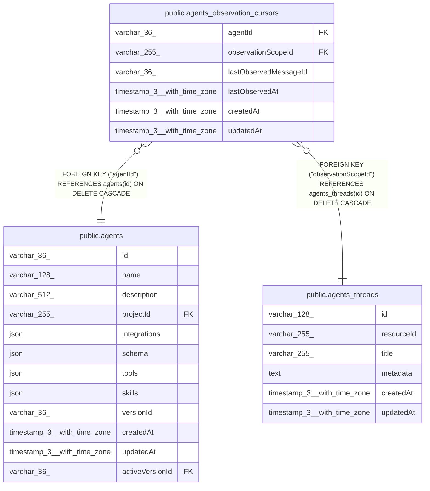

# public.agents_observation_cursors

## Columns

| Name | Type | Default | Nullable | Children | Parents | Comment |
| ---- | ---- | ------- | -------- | -------- | ------- | ------- |
| agentId | varchar(36) |  | false |  | [public.agents](public.agents.md) | Agent that owns this cursor |
| observationScopeId | varchar(255) |  | false |  | [public.agents_threads](public.agents_threads.md) | agents_threads.id source stream checkpointed by this cursor |
| lastObservedMessageId | varchar(36) |  | false |  |  |  |
| lastObservedAt | timestamp(3) with time zone |  | false |  |  |  |
| createdAt | timestamp(3) with time zone | CURRENT_TIMESTAMP(3) | false |  |  |  |
| updatedAt | timestamp(3) with time zone | CURRENT_TIMESTAMP(3) | false |  |  |  |

## Constraints

| Name | Type | Definition |
| ---- | ---- | ---------- |
| agents_observation_cursors_agentId_not_null | n | NOT NULL "agentId" |
| agents_observation_cursors_createdAt_not_null | n | NOT NULL "createdAt" |
| agents_observation_cursors_lastObservedAt_not_null | n | NOT NULL "lastObservedAt" |
| agents_observation_cursors_lastObservedMessageId_not_null | n | NOT NULL "lastObservedMessageId" |
| agents_observation_cursors_observationScopeId_not_null | n | NOT NULL "observationScopeId" |
| agents_observation_cursors_updatedAt_not_null | n | NOT NULL "updatedAt" |
| FK_64e92819f4b413661ed6e2c3c3d | FOREIGN KEY | FOREIGN KEY ("agentId") REFERENCES agents(id) ON DELETE CASCADE |
| PK_eb777ac57ab872d38f8ebd19317 | PRIMARY KEY | PRIMARY KEY ("agentId", "observationScopeId") |
| FK_87aa187d27ea67eafd164905154 | FOREIGN KEY | FOREIGN KEY ("observationScopeId") REFERENCES agents_threads(id) ON DELETE CASCADE |

## Indexes

| Name | Definition |
| ---- | ---------- |
| PK_eb777ac57ab872d38f8ebd19317 | CREATE UNIQUE INDEX "PK_eb777ac57ab872d38f8ebd19317" ON public.agents_observation_cursors USING btree ("agentId", "observationScopeId") |
| IDX_87aa187d27ea67eafd16490515 | CREATE INDEX "IDX_87aa187d27ea67eafd16490515" ON public.agents_observation_cursors USING btree ("observationScopeId") |

## Relations

---

> Generated by [tbls](https://github.com/k1LoW/tbls)
