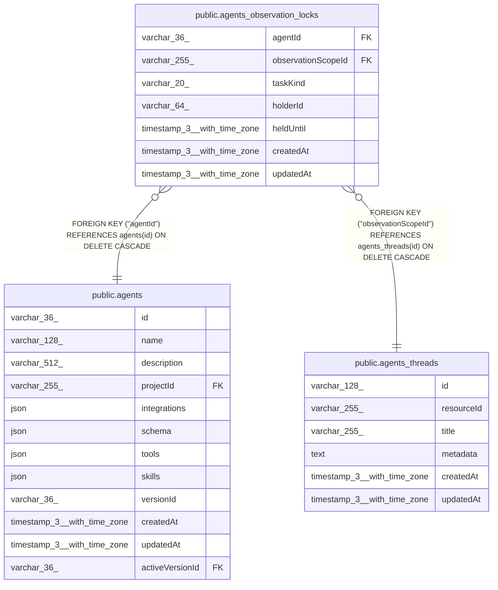

# public.agents_observation_locks

## Columns

| Name | Type | Default | Nullable | Children | Parents | Comment |
| ---- | ---- | ------- | -------- | -------- | ------- | ------- |
| agentId | varchar(36) |  | false |  | [public.agents](public.agents.md) | Agent that owns this lock |
| observationScopeId | varchar(255) |  | false |  | [public.agents_threads](public.agents_threads.md) | agents_threads.id source stream locked for observation tasks |
| taskKind | varchar(20) |  | false |  |  |  |
| holderId | varchar(64) |  | false |  |  | Ephemeral background-task lock owner token, not a user ID |
| heldUntil | timestamp(3) with time zone |  | false |  |  |  |
| createdAt | timestamp(3) with time zone | CURRENT_TIMESTAMP(3) | false |  |  |  |
| updatedAt | timestamp(3) with time zone | CURRENT_TIMESTAMP(3) | false |  |  |  |

## Constraints

| Name | Type | Definition |
| ---- | ---- | ---------- |
| CHK_agents_observation_locks_taskKind | CHECK | CHECK ((("taskKind")::text = ANY ((ARRAY['observer'::character varying, 'reflector'::character varying])::text[]))) |
| agents_observation_locks_agentId_not_null | n | NOT NULL "agentId" |
| agents_observation_locks_createdAt_not_null | n | NOT NULL "createdAt" |
| agents_observation_locks_heldUntil_not_null | n | NOT NULL "heldUntil" |
| agents_observation_locks_holderId_not_null | n | NOT NULL "holderId" |
| agents_observation_locks_observationScopeId_not_null | n | NOT NULL "observationScopeId" |
| agents_observation_locks_taskKind_not_null | n | NOT NULL "taskKind" |
| agents_observation_locks_updatedAt_not_null | n | NOT NULL "updatedAt" |
| FK_093e44ae20f2518e97d83a95433 | FOREIGN KEY | FOREIGN KEY ("agentId") REFERENCES agents(id) ON DELETE CASCADE |
| PK_7e2e315162ac3d80587e15ac2c3 | PRIMARY KEY | PRIMARY KEY ("agentId", "observationScopeId", "taskKind") |
| FK_6b55089892e447c2f82e5ec60ed | FOREIGN KEY | FOREIGN KEY ("observationScopeId") REFERENCES agents_threads(id) ON DELETE CASCADE |

## Indexes

| Name | Definition |
| ---- | ---------- |
| PK_7e2e315162ac3d80587e15ac2c3 | CREATE UNIQUE INDEX "PK_7e2e315162ac3d80587e15ac2c3" ON public.agents_observation_locks USING btree ("agentId", "observationScopeId", "taskKind") |
| IDX_6b55089892e447c2f82e5ec60e | CREATE INDEX "IDX_6b55089892e447c2f82e5ec60e" ON public.agents_observation_locks USING btree ("observationScopeId") |

## Relations

---

> Generated by [tbls](https://github.com/k1LoW/tbls)
