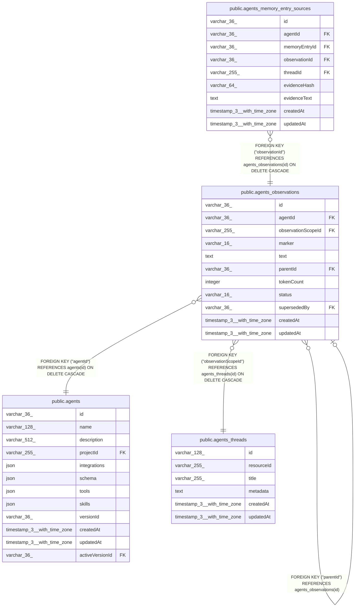

# public.agents_observations

## Columns

| Name | Type | Default | Nullable | Children | Parents | Comment |
| ---- | ---- | ------- | -------- | -------- | ------- | ------- |
| id | varchar(36) |  | false | [public.agents_observations](public.agents_observations.md) [public.agents_memory_entry_sources](public.agents_memory_entry_sources.md) |  | Application-generated n8n string ID, not a database UUID |
| agentId | varchar(36) |  | false |  | [public.agents](public.agents.md) | Agent that owns this observation row |
| observationScopeId | varchar(255) |  | false |  | [public.agents_threads](public.agents_threads.md) | agents_threads.id source stream for this observation log |
| marker | varchar(16) |  | false |  |  |  |
| text | text |  | false |  |  |  |
| parentId | varchar(36) |  | true |  | [public.agents_observations](public.agents_observations.md) |  |
| tokenCount | integer | 0 | false |  |  |  |
| status | varchar(16) |  | false |  |  |  |
| supersededBy | varchar(36) |  | true |  | [public.agents_observations](public.agents_observations.md) |  |
| createdAt | timestamp(3) with time zone | CURRENT_TIMESTAMP(3) | false |  |  |  |
| updatedAt | timestamp(3) with time zone | CURRENT_TIMESTAMP(3) | false |  |  |  |

## Constraints

| Name | Type | Definition |
| ---- | ---- | ---------- |
| CHK_agents_observations_marker | CHECK | CHECK (((marker)::text = ANY ((ARRAY['critical'::character varying, 'important'::character varying, 'info'::character varying, 'completion'::character varying])::text[]))) |
| CHK_agents_observations_status | CHECK | CHECK (((status)::text = ANY ((ARRAY['active'::character varying, 'superseded'::character varying, 'dropped'::character varying])::text[]))) |
| agents_observations_agentId_not_null | n | NOT NULL "agentId" |
| agents_observations_createdAt_not_null | n | NOT NULL "createdAt" |
| agents_observations_id_not_null | n | NOT NULL id |
| agents_observations_marker_not_null | n | NOT NULL marker |
| agents_observations_observationScopeId_not_null | n | NOT NULL "observationScopeId" |
| agents_observations_status_not_null | n | NOT NULL status |
| agents_observations_text_not_null | n | NOT NULL text |
| agents_observations_tokenCount_not_null | n | NOT NULL "tokenCount" |
| agents_observations_updatedAt_not_null | n | NOT NULL "updatedAt" |
| FK_d206432be97b7ed88d187479b1b | FOREIGN KEY | FOREIGN KEY ("agentId") REFERENCES agents(id) ON DELETE CASCADE |
| FK_127ee1078ffa952bb37b511efad | FOREIGN KEY | FOREIGN KEY ("supersededBy") REFERENCES agents_observations(id) |
| FK_501e2d1701a10e24fb69ab5fc5f | FOREIGN KEY | FOREIGN KEY ("parentId") REFERENCES agents_observations(id) |
| PK_9ad319654d12c2649f7caf27135 | PRIMARY KEY | PRIMARY KEY (id) |
| FK_4cfd8a70ebb0a5b0cf047dca3cf | FOREIGN KEY | FOREIGN KEY ("observationScopeId") REFERENCES agents_threads(id) ON DELETE CASCADE |

## Indexes

| Name | Definition |
| ---- | ---------- |
| PK_9ad319654d12c2649f7caf27135 | CREATE UNIQUE INDEX "PK_9ad319654d12c2649f7caf27135" ON public.agents_observations USING btree (id) |
| IDX_07cb1e4a302629c5fa5d74d2bb | CREATE INDEX "IDX_07cb1e4a302629c5fa5d74d2bb" ON public.agents_observations USING btree ("agentId", "observationScopeId", status) |
| IDX_4cfd8a70ebb0a5b0cf047dca3c | CREATE INDEX "IDX_4cfd8a70ebb0a5b0cf047dca3c" ON public.agents_observations USING btree ("observationScopeId") |
| IDX_501e2d1701a10e24fb69ab5fc5 | CREATE INDEX "IDX_501e2d1701a10e24fb69ab5fc5" ON public.agents_observations USING btree ("parentId") |
| IDX_127ee1078ffa952bb37b511efa | CREATE INDEX "IDX_127ee1078ffa952bb37b511efa" ON public.agents_observations USING btree ("supersededBy") |

## Relations

---

> Generated by [tbls](https://github.com/k1LoW/tbls)
