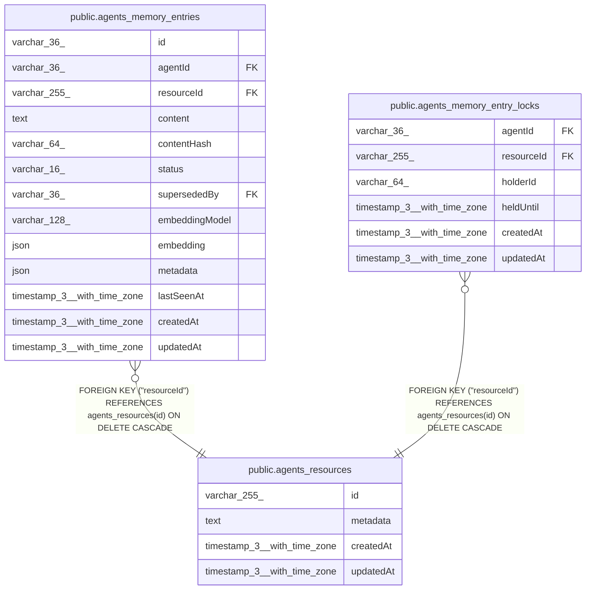

# public.agents_resources

## Columns

| Name | Type | Default | Nullable | Children | Parents | Comment |
| ---- | ---- | ------- | -------- | -------- | ------- | ------- |
| id | varchar(255) |  | false | [public.agents_memory_entries](public.agents_memory_entries.md) [public.agents_memory_entry_locks](public.agents_memory_entry_locks.md) |  |  |
| metadata | text |  | true |  |  |  |
| createdAt | timestamp(3) with time zone | CURRENT_TIMESTAMP(3) | false |  |  |  |
| updatedAt | timestamp(3) with time zone | CURRENT_TIMESTAMP(3) | false |  |  |  |

## Constraints

| Name | Type | Definition |
| ---- | ---- | ---------- |
| agents_resources_createdAt_not_null | n | NOT NULL "createdAt" |
| agents_resources_id_not_null | n | NOT NULL id |
| agents_resources_updatedAt_not_null | n | NOT NULL "updatedAt" |
| PK_fa6b20b2d31a9991529dbf8ef7d | PRIMARY KEY | PRIMARY KEY (id) |

## Indexes

| Name | Definition |
| ---- | ---------- |
| PK_fa6b20b2d31a9991529dbf8ef7d | CREATE UNIQUE INDEX "PK_fa6b20b2d31a9991529dbf8ef7d" ON public.agents_resources USING btree (id) |

## Relations

---

> Generated by [tbls](https://github.com/k1LoW/tbls)
