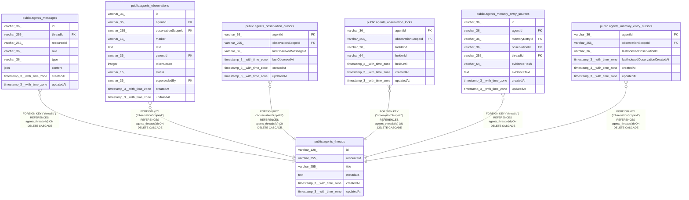

# public.agents_threads

## Columns

| Name | Type | Default | Nullable | Children | Parents | Comment |
| ---- | ---- | ------- | -------- | -------- | ------- | ------- |
| id | varchar(128) |  | false | [public.agents_messages](public.agents_messages.md) [public.agents_observations](public.agents_observations.md) [public.agents_observation_cursors](public.agents_observation_cursors.md) [public.agents_observation_locks](public.agents_observation_locks.md) [public.agents_memory_entry_sources](public.agents_memory_entry_sources.md) [public.agents_memory_entry_cursors](public.agents_memory_entry_cursors.md) |  |  |
| resourceId | varchar(255) |  | false |  |  |  |
| title | varchar(255) |  | true |  |  |  |
| metadata | text |  | true |  |  |  |
| createdAt | timestamp(3) with time zone | CURRENT_TIMESTAMP(3) | false |  |  |  |
| updatedAt | timestamp(3) with time zone | CURRENT_TIMESTAMP(3) | false |  |  |  |

## Constraints

| Name | Type | Definition |
| ---- | ---- | ---------- |
| agents_threads_createdAt_not_null | n | NOT NULL "createdAt" |
| agents_threads_id_not_null | n | NOT NULL id |
| agents_threads_resourceId_not_null | n | NOT NULL "resourceId" |
| agents_threads_updatedAt_not_null | n | NOT NULL "updatedAt" |
| PK_4a3feb0a13ffe315c009cce64e5 | PRIMARY KEY | PRIMARY KEY (id) |

## Indexes

| Name | Definition |
| ---- | ---------- |
| IDX_54fa1b94f34a409beafae567a4 | CREATE INDEX "IDX_54fa1b94f34a409beafae567a4" ON public.agents_threads USING btree ("resourceId") |
| PK_4a3feb0a13ffe315c009cce64e5 | CREATE UNIQUE INDEX "PK_4a3feb0a13ffe315c009cce64e5" ON public.agents_threads USING btree (id) |

## Relations

---

> Generated by [tbls](https://github.com/k1LoW/tbls)
