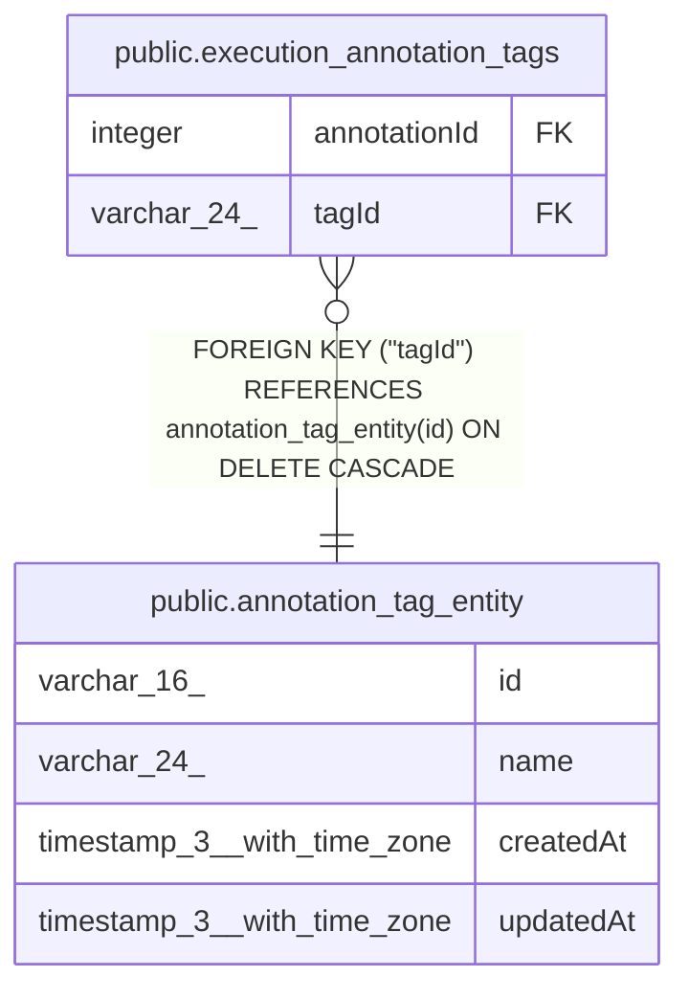

# public.annotation_tag_entity

## Columns

| Name | Type | Default | Nullable | Children | Parents | Comment |
| ---- | ---- | ------- | -------- | -------- | ------- | ------- |
| id | varchar(16) |  | false | [public.execution_annotation_tags](public.execution_annotation_tags.md) |  |  |
| name | varchar(24) |  | false |  |  |  |
| createdAt | timestamp(3) with time zone | CURRENT_TIMESTAMP(3) | false |  |  |  |
| updatedAt | timestamp(3) with time zone | CURRENT_TIMESTAMP(3) | false |  |  |  |

## Constraints

| Name | Type | Definition |
| ---- | ---- | ---------- |
| annotation_tag_entity_createdAt_not_null | n | NOT NULL "createdAt" |
| annotation_tag_entity_id_not_null | n | NOT NULL id |
| annotation_tag_entity_name_not_null | n | NOT NULL name |
| annotation_tag_entity_updatedAt_not_null | n | NOT NULL "updatedAt" |
| PK_69dfa041592c30bbc0d4b84aa00 | PRIMARY KEY | PRIMARY KEY (id) |

## Indexes

| Name | Definition |
| ---- | ---------- |
| PK_69dfa041592c30bbc0d4b84aa00 | CREATE UNIQUE INDEX "PK_69dfa041592c30bbc0d4b84aa00" ON public.annotation_tag_entity USING btree (id) |
| IDX_ae51b54c4bb430cf92f48b623f | CREATE UNIQUE INDEX "IDX_ae51b54c4bb430cf92f48b623f" ON public.annotation_tag_entity USING btree (name) |

## Relations

---

> Generated by [tbls](https://github.com/k1LoW/tbls)
