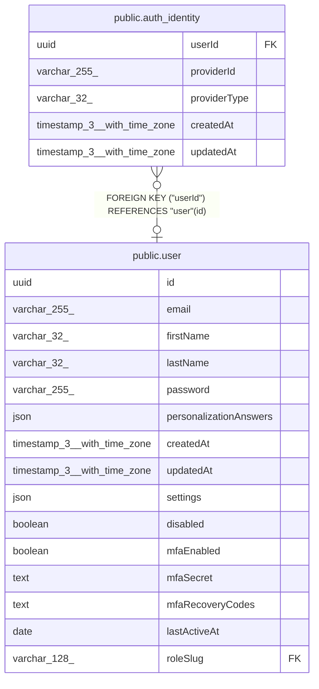

# public.auth_identity

## Columns

| Name | Type | Default | Nullable | Children | Parents | Comment |
| ---- | ---- | ------- | -------- | -------- | ------- | ------- |
| userId | uuid |  | true |  | [public.user](public.user.md) |  |
| providerId | varchar(255) |  | false |  |  |  |
| providerType | varchar(32) |  | false |  |  |  |
| createdAt | timestamp(3) with time zone | CURRENT_TIMESTAMP(3) | false |  |  |  |
| updatedAt | timestamp(3) with time zone | CURRENT_TIMESTAMP(3) | false |  |  |  |

## Constraints

| Name | Type | Definition |
| ---- | ---- | ---------- |
| auth_identity_createdAt_not_null | n | NOT NULL "createdAt" |
| auth_identity_providerId_not_null | n | NOT NULL "providerId" |
| auth_identity_providerType_not_null | n | NOT NULL "providerType" |
| auth_identity_updatedAt_not_null | n | NOT NULL "updatedAt" |
| auth_identity_userId_fkey | FOREIGN KEY | FOREIGN KEY ("userId") REFERENCES "user"(id) |
| auth_identity_pkey | PRIMARY KEY | PRIMARY KEY ("providerId", "providerType") |

## Indexes

| Name | Definition |
| ---- | ---------- |
| auth_identity_pkey | CREATE UNIQUE INDEX auth_identity_pkey ON public.auth_identity USING btree ("providerId", "providerType") |

## Relations

---

> Generated by [tbls](https://github.com/k1LoW/tbls)
