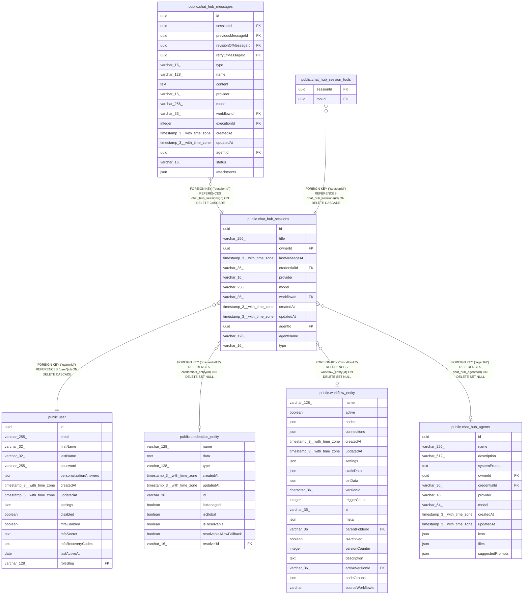

# public.chat_hub_sessions

## Columns

| Name | Type | Default | Nullable | Children | Parents | Comment |
| ---- | ---- | ------- | -------- | -------- | ------- | ------- |
| id | uuid |  | false | [public.chat_hub_messages](public.chat_hub_messages.md) [public.chat_hub_session_tools](public.chat_hub_session_tools.md) |  |  |
| title | varchar(256) |  | false |  |  |  |
| ownerId | uuid |  | false |  | [public.user](public.user.md) |  |
| lastMessageAt | timestamp(3) with time zone |  | false |  |  |  |
| credentialId | varchar(36) |  | true |  | [public.credentials_entity](public.credentials_entity.md) |  |
| provider | varchar(16) |  | true |  |  | ChatHubProvider enum: "openai", "anthropic", "google", "n8n" |
| model | varchar(256) |  | true |  |  | Model name used at the respective Model node, ie. "gpt-4" |
| workflowId | varchar(36) |  | true |  | [public.workflow_entity](public.workflow_entity.md) |  |
| createdAt | timestamp(3) with time zone | CURRENT_TIMESTAMP(3) | false |  |  |  |
| updatedAt | timestamp(3) with time zone | CURRENT_TIMESTAMP(3) | false |  |  |  |
| agentId | uuid |  | true |  | [public.chat_hub_agents](public.chat_hub_agents.md) | ID of the custom agent (if provider is "custom-agent") |
| agentName | varchar(128) |  | true |  |  | Cached name of the custom agent (if provider is "custom-agent") |
| type | varchar(16) | 'production'::character varying | false |  |  |  |

## Constraints

| Name | Type | Definition |
| ---- | ---- | ---------- |
| CHK_chat_hub_sessions_type | CHECK | CHECK (((type)::text = ANY ((ARRAY['production'::character varying, 'manual'::character varying])::text[]))) |
| chat_hub_sessions_createdAt_not_null | n | NOT NULL "createdAt" |
| chat_hub_sessions_id_not_null | n | NOT NULL id |
| chat_hub_sessions_lastMessageAt_not_null | n | NOT NULL "lastMessageAt" |
| chat_hub_sessions_ownerId_not_null | n | NOT NULL "ownerId" |
| chat_hub_sessions_title_not_null | n | NOT NULL title |
| chat_hub_sessions_type_not_null | n | NOT NULL type |
| chat_hub_sessions_updatedAt_not_null | n | NOT NULL "updatedAt" |
| FK_e9ecf8ede7d989fcd18790fe36a | FOREIGN KEY | FOREIGN KEY ("ownerId") REFERENCES "user"(id) ON DELETE CASCADE |
| FK_9f9293d9f552496c40e0d1a8f80 | FOREIGN KEY | FOREIGN KEY ("workflowId") REFERENCES workflow_entity(id) ON DELETE SET NULL |
| FK_7bc13b4c7e6afbfaf9be326c189 | FOREIGN KEY | FOREIGN KEY ("credentialId") REFERENCES credentials_entity(id) ON DELETE SET NULL |
| PK_1eafef1273c70e4464fec703412 | PRIMARY KEY | PRIMARY KEY (id) |
| FK_chat_hub_sessions_agentId | FOREIGN KEY | FOREIGN KEY ("agentId") REFERENCES chat_hub_agents(id) ON DELETE SET NULL |

## Indexes

| Name | Definition |
| ---- | ---------- |
| PK_1eafef1273c70e4464fec703412 | CREATE UNIQUE INDEX "PK_1eafef1273c70e4464fec703412" ON public.chat_hub_sessions USING btree (id) |
| IDX_chat_hub_sessions_owner_lastmsg_id | CREATE INDEX "IDX_chat_hub_sessions_owner_lastmsg_id" ON public.chat_hub_sessions USING btree ("ownerId", "lastMessageAt" DESC, id) |

## Relations

---

> Generated by [tbls](https://github.com/k1LoW/tbls)
