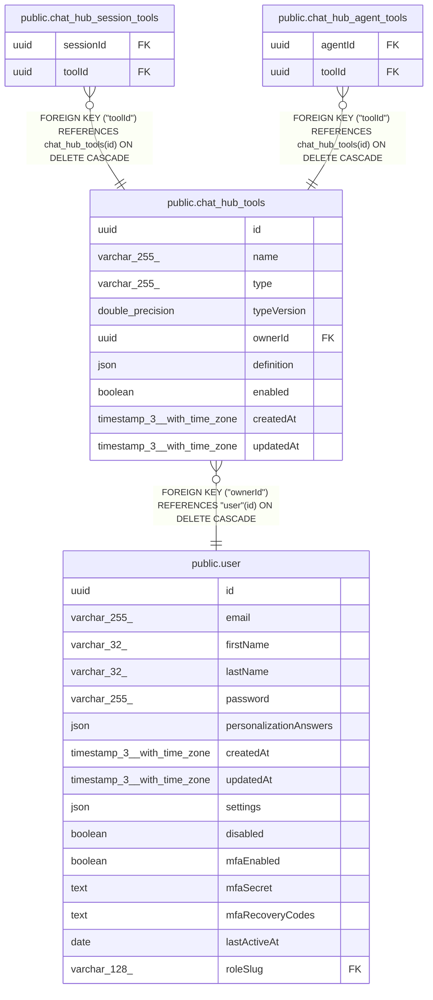

# public.chat_hub_tools

## Columns

| Name | Type | Default | Nullable | Children | Parents | Comment |
| ---- | ---- | ------- | -------- | -------- | ------- | ------- |
| id | uuid |  | false | [public.chat_hub_session_tools](public.chat_hub_session_tools.md) [public.chat_hub_agent_tools](public.chat_hub_agent_tools.md) |  |  |
| name | varchar(255) |  | false |  |  |  |
| type | varchar(255) |  | false |  |  |  |
| typeVersion | double precision |  | false |  |  |  |
| ownerId | uuid |  | false |  | [public.user](public.user.md) |  |
| definition | json |  | false |  |  |  |
| enabled | boolean | true | false |  |  |  |
| createdAt | timestamp(3) with time zone | CURRENT_TIMESTAMP(3) | false |  |  |  |
| updatedAt | timestamp(3) with time zone | CURRENT_TIMESTAMP(3) | false |  |  |  |

## Constraints

| Name | Type | Definition |
| ---- | ---- | ---------- |
| chat_hub_tools_createdAt_not_null | n | NOT NULL "createdAt" |
| chat_hub_tools_definition_not_null | n | NOT NULL definition |
| chat_hub_tools_enabled_not_null | n | NOT NULL enabled |
| chat_hub_tools_id_not_null | n | NOT NULL id |
| chat_hub_tools_name_not_null | n | NOT NULL name |
| chat_hub_tools_ownerId_not_null | n | NOT NULL "ownerId" |
| chat_hub_tools_typeVersion_not_null | n | NOT NULL "typeVersion" |
| chat_hub_tools_type_not_null | n | NOT NULL type |
| chat_hub_tools_updatedAt_not_null | n | NOT NULL "updatedAt" |
| FK_b8030b47af9213f1fd15450fb7f | FOREIGN KEY | FOREIGN KEY ("ownerId") REFERENCES "user"(id) ON DELETE CASCADE |
| PK_696d26426c704fba79b2c195ef5 | PRIMARY KEY | PRIMARY KEY (id) |

## Indexes

| Name | Definition |
| ---- | ---------- |
| PK_696d26426c704fba79b2c195ef5 | CREATE UNIQUE INDEX "PK_696d26426c704fba79b2c195ef5" ON public.chat_hub_tools USING btree (id) |
| IDX_4c72ebdb265d1775bf61147af0 | CREATE UNIQUE INDEX "IDX_4c72ebdb265d1775bf61147af0" ON public.chat_hub_tools USING btree ("ownerId", name) |

## Relations

---

> Generated by [tbls](https://github.com/k1LoW/tbls)
