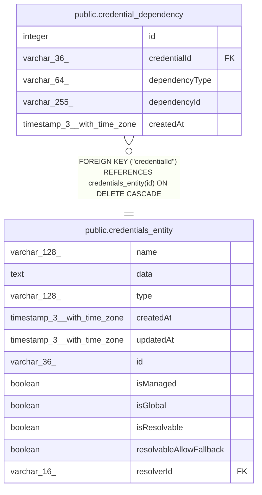

# public.credential_dependency

## Columns

| Name | Type | Default | Nullable | Children | Parents | Comment |
| ---- | ---- | ------- | -------- | -------- | ------- | ------- |
| id | integer |  | false |  |  |  |
| credentialId | varchar(36) |  | false |  | [public.credentials_entity](public.credentials_entity.md) |  |
| dependencyType | varchar(64) |  | false |  |  |  |
| dependencyId | varchar(255) |  | false |  |  |  |
| createdAt | timestamp(3) with time zone | CURRENT_TIMESTAMP(3) | false |  |  |  |

## Constraints

| Name | Type | Definition |
| ---- | ---- | ---------- |
| credential_dependency_createdAt_not_null | n | NOT NULL "createdAt" |
| credential_dependency_credentialId_not_null | n | NOT NULL "credentialId" |
| credential_dependency_dependencyId_not_null | n | NOT NULL "dependencyId" |
| credential_dependency_dependencyType_not_null | n | NOT NULL "dependencyType" |
| credential_dependency_id_not_null | n | NOT NULL id |
| FK_5ec8e8c8d3539f3696cf73b43bf | FOREIGN KEY | FOREIGN KEY ("credentialId") REFERENCES credentials_entity(id) ON DELETE CASCADE |
| PK_80212729ed0ffa0709417ab28f4 | PRIMARY KEY | PRIMARY KEY (id) |

## Indexes

| Name | Definition |
| ---- | ---------- |
| PK_80212729ed0ffa0709417ab28f4 | CREATE UNIQUE INDEX "PK_80212729ed0ffa0709417ab28f4" ON public.credential_dependency USING btree (id) |
| IDX_5ec8e8c8d3539f3696cf73b43b | CREATE INDEX "IDX_5ec8e8c8d3539f3696cf73b43b" ON public.credential_dependency USING btree ("credentialId") |
| IDX_91ee85fa9619dd6776725e117b | CREATE INDEX "IDX_91ee85fa9619dd6776725e117b" ON public.credential_dependency USING btree ("dependencyType", "dependencyId") |
| IDX_credential_dependency_credentialId_dependencyType_dependenc | CREATE UNIQUE INDEX "IDX_credential_dependency_credentialId_dependencyType_dependenc" ON public.credential_dependency USING btree ("credentialId", "dependencyType", "dependencyId") |

## Relations

---

> Generated by [tbls](https://github.com/k1LoW/tbls)
