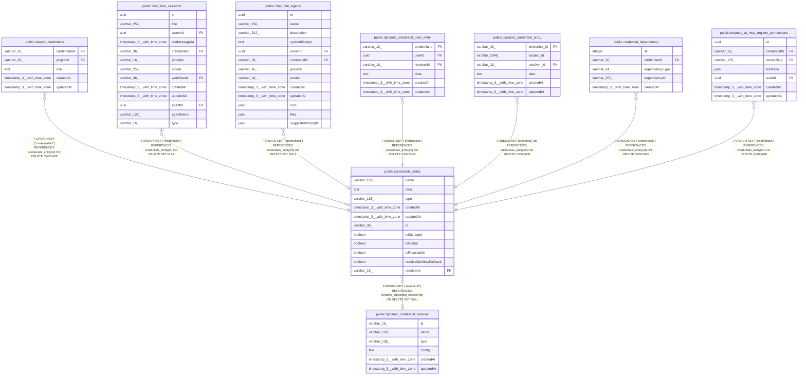

# public.credentials_entity

## Columns

| Name | Type | Default | Nullable | Children | Parents | Comment |
| ---- | ---- | ------- | -------- | -------- | ------- | ------- |
| name | varchar(128) |  | false |  |  |  |
| data | text |  | false |  |  |  |
| type | varchar(128) |  | false |  |  |  |
| createdAt | timestamp(3) with time zone | CURRENT_TIMESTAMP(3) | false |  |  |  |
| updatedAt | timestamp(3) with time zone | CURRENT_TIMESTAMP(3) | false |  |  |  |
| id | varchar(36) |  | false | [public.shared_credentials](public.shared_credentials.md) [public.chat_hub_sessions](public.chat_hub_sessions.md) [public.chat_hub_agents](public.chat_hub_agents.md) [public.dynamic_credential_user_entry](public.dynamic_credential_user_entry.md) [public.dynamic_credential_entry](public.dynamic_credential_entry.md) [public.credential_dependency](public.credential_dependency.md) [public.instance_ai_mcp_registry_connections](public.instance_ai_mcp_registry_connections.md) |  |  |
| isManaged | boolean | false | false |  |  |  |
| isGlobal | boolean | false | false |  |  |  |
| isResolvable | boolean | false | false |  |  |  |
| resolvableAllowFallback | boolean | false | false |  |  |  |
| resolverId | varchar(16) |  | true |  | [public.dynamic_credential_resolver](public.dynamic_credential_resolver.md) |  |

## Constraints

| Name | Type | Definition |
| ---- | ---- | ---------- |
| credentials_entity_createdAt_not_null | n | NOT NULL "createdAt" |
| credentials_entity_data_not_null | n | NOT NULL data |
| credentials_entity_id_not_null1 | n | NOT NULL id |
| credentials_entity_isGlobal_not_null | n | NOT NULL "isGlobal" |
| credentials_entity_isManaged_not_null | n | NOT NULL "isManaged" |
| credentials_entity_isResolvable_not_null | n | NOT NULL "isResolvable" |
| credentials_entity_name_not_null | n | NOT NULL name |
| credentials_entity_resolvableAllowFallback_not_null | n | NOT NULL "resolvableAllowFallback" |
| credentials_entity_type_not_null | n | NOT NULL type |
| credentials_entity_updatedAt_not_null | n | NOT NULL "updatedAt" |
| credentials_entity_pkey | PRIMARY KEY | PRIMARY KEY (id) |
| credentials_entity_resolverId_foreign | FOREIGN KEY | FOREIGN KEY ("resolverId") REFERENCES dynamic_credential_resolver(id) ON DELETE SET NULL |

## Indexes

| Name | Definition |
| ---- | ---------- |
| idx_07fde106c0b471d8cc80a64fc8 | CREATE INDEX idx_07fde106c0b471d8cc80a64fc8 ON public.credentials_entity USING btree (type) |
| pk_credentials_entity_id | CREATE UNIQUE INDEX pk_credentials_entity_id ON public.credentials_entity USING btree (id) |
| credentials_entity_pkey | CREATE UNIQUE INDEX credentials_entity_pkey ON public.credentials_entity USING btree (id) |

## Relations

---

> Generated by [tbls](https://github.com/k1LoW/tbls)
