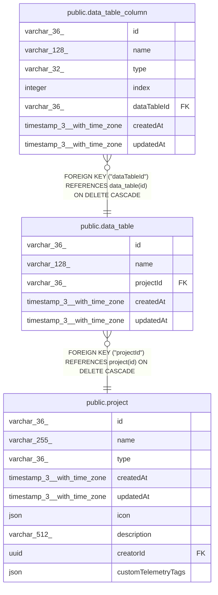

# public.data_table

## Columns

| Name | Type | Default | Nullable | Children | Parents | Comment |
| ---- | ---- | ------- | -------- | -------- | ------- | ------- |
| id | varchar(36) |  | false | [public.data_table_column](public.data_table_column.md) |  |  |
| name | varchar(128) |  | false |  |  |  |
| projectId | varchar(36) |  | false |  | [public.project](public.project.md) |  |
| createdAt | timestamp(3) with time zone | CURRENT_TIMESTAMP(3) | false |  |  |  |
| updatedAt | timestamp(3) with time zone | CURRENT_TIMESTAMP(3) | false |  |  |  |

## Constraints

| Name | Type | Definition |
| ---- | ---- | ---------- |
| data_table_createdAt_not_null | n | NOT NULL "createdAt" |
| data_table_id_not_null | n | NOT NULL id |
| data_table_name_not_null | n | NOT NULL name |
| data_table_projectId_not_null | n | NOT NULL "projectId" |
| data_table_updatedAt_not_null | n | NOT NULL "updatedAt" |
| FK_c2a794257dee48af7c9abf681de | FOREIGN KEY | FOREIGN KEY ("projectId") REFERENCES project(id) ON DELETE CASCADE |
| PK_e226d0001b9e6097cbfe70617cb | PRIMARY KEY | PRIMARY KEY (id) |
| UQ_b23096ef747281ac944d28e8b0d | UNIQUE | UNIQUE ("projectId", name) |

## Indexes

| Name | Definition |
| ---- | ---------- |
| PK_e226d0001b9e6097cbfe70617cb | CREATE UNIQUE INDEX "PK_e226d0001b9e6097cbfe70617cb" ON public.data_table USING btree (id) |
| UQ_b23096ef747281ac944d28e8b0d | CREATE UNIQUE INDEX "UQ_b23096ef747281ac944d28e8b0d" ON public.data_table USING btree ("projectId", name) |

## Relations

---

> Generated by [tbls](https://github.com/k1LoW/tbls)
