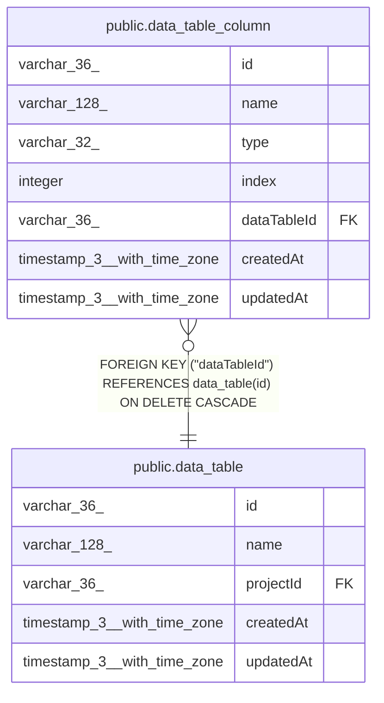

# public.data_table_column

## Columns

| Name | Type | Default | Nullable | Children | Parents | Comment |
| ---- | ---- | ------- | -------- | -------- | ------- | ------- |
| id | varchar(36) |  | false |  |  |  |
| name | varchar(128) |  | false |  |  |  |
| type | varchar(32) |  | false |  |  | Expected: string, number, boolean, or date (not enforced as a constraint) |
| index | integer |  | false |  |  | Column order, starting from 0 (0 = first column) |
| dataTableId | varchar(36) |  | false |  | [public.data_table](public.data_table.md) |  |
| createdAt | timestamp(3) with time zone | CURRENT_TIMESTAMP(3) | false |  |  |  |
| updatedAt | timestamp(3) with time zone | CURRENT_TIMESTAMP(3) | false |  |  |  |

## Constraints

| Name | Type | Definition |
| ---- | ---- | ---------- |
| data_table_column_createdAt_not_null | n | NOT NULL "createdAt" |
| data_table_column_dataTableId_not_null | n | NOT NULL "dataTableId" |
| data_table_column_id_not_null | n | NOT NULL id |
| data_table_column_index_not_null | n | NOT NULL index |
| data_table_column_name_not_null | n | NOT NULL name |
| data_table_column_type_not_null | n | NOT NULL type |
| data_table_column_updatedAt_not_null | n | NOT NULL "updatedAt" |
| FK_930b6e8faaf88294cef23484160 | FOREIGN KEY | FOREIGN KEY ("dataTableId") REFERENCES data_table(id) ON DELETE CASCADE |
| PK_673cb121ee4a8a5e27850c72c51 | PRIMARY KEY | PRIMARY KEY (id) |
| UQ_8082ec4890f892f0bc77473a123 | UNIQUE | UNIQUE ("dataTableId", name) |

## Indexes

| Name | Definition |
| ---- | ---------- |
| PK_673cb121ee4a8a5e27850c72c51 | CREATE UNIQUE INDEX "PK_673cb121ee4a8a5e27850c72c51" ON public.data_table_column USING btree (id) |
| UQ_8082ec4890f892f0bc77473a123 | CREATE UNIQUE INDEX "UQ_8082ec4890f892f0bc77473a123" ON public.data_table_column USING btree ("dataTableId", name) |

## Relations

---

> Generated by [tbls](https://github.com/k1LoW/tbls)
