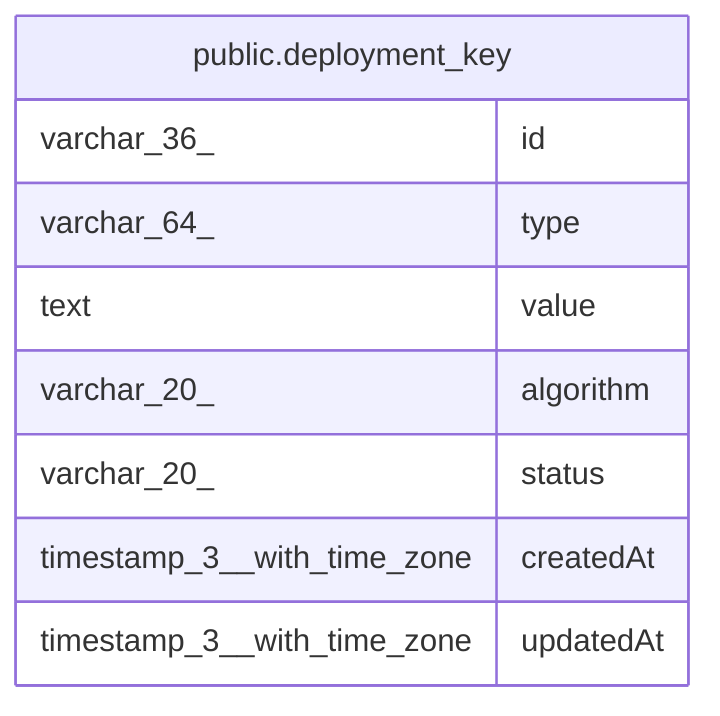

# public.deployment_key

## Columns

| Name | Type | Default | Nullable | Children | Parents | Comment |
| ---- | ---- | ------- | -------- | -------- | ------- | ------- |
| id | varchar(36) |  | false |  |  |  |
| type | varchar(64) |  | false |  |  |  |
| value | text |  | false |  |  |  |
| algorithm | varchar(20) |  | true |  |  |  |
| status | varchar(20) |  | false |  |  |  |
| createdAt | timestamp(3) with time zone | CURRENT_TIMESTAMP(3) | false |  |  |  |
| updatedAt | timestamp(3) with time zone | CURRENT_TIMESTAMP(3) | false |  |  |  |

## Constraints

| Name | Type | Definition |
| ---- | ---- | ---------- |
| deployment_key_createdAt_not_null | n | NOT NULL "createdAt" |
| deployment_key_id_not_null | n | NOT NULL id |
| deployment_key_status_not_null | n | NOT NULL status |
| deployment_key_type_not_null | n | NOT NULL type |
| deployment_key_updatedAt_not_null | n | NOT NULL "updatedAt" |
| deployment_key_value_not_null | n | NOT NULL value |
| PK_94bb7aeb5def5a0284a5fe9f9a0 | PRIMARY KEY | PRIMARY KEY (id) |

## Indexes

| Name | Definition |
| ---- | ---------- |
| PK_94bb7aeb5def5a0284a5fe9f9a0 | CREATE UNIQUE INDEX "PK_94bb7aeb5def5a0284a5fe9f9a0" ON public.deployment_key USING btree (id) |
| IDX_deployment_key_data_encryption_active | CREATE UNIQUE INDEX "IDX_deployment_key_data_encryption_active" ON public.deployment_key USING btree (type) WHERE (((status)::text = 'active'::text) AND ((type)::text = 'data_encryption'::text)) |
| IDX_deployment_key_instance_id_active | CREATE UNIQUE INDEX "IDX_deployment_key_instance_id_active" ON public.deployment_key USING btree (type) WHERE (((status)::text = 'active'::text) AND ((type)::text = 'instance.id'::text)) |
| IDX_deployment_key_signing_jwt_active | CREATE UNIQUE INDEX "IDX_deployment_key_signing_jwt_active" ON public.deployment_key USING btree (type) WHERE (((status)::text = 'active'::text) AND ((type)::text = 'signing.jwt'::text)) |
| IDX_deployment_key_signing_hmac_active | CREATE UNIQUE INDEX "IDX_deployment_key_signing_hmac_active" ON public.deployment_key USING btree (type) WHERE (((status)::text = 'active'::text) AND ((type)::text = 'signing.hmac'::text)) |
| IDX_deployment_key_signing_binary_data_active | CREATE UNIQUE INDEX "IDX_deployment_key_signing_binary_data_active" ON public.deployment_key USING btree (type) WHERE (((status)::text = 'active'::text) AND ((type)::text = 'signing.binary_data'::text)) |
| IDX_deployment_key_jwe_private_key_active | CREATE UNIQUE INDEX "IDX_deployment_key_jwe_private_key_active" ON public.deployment_key USING btree (type, algorithm) WHERE (((status)::text = 'active'::text) AND ((type)::text = 'jwe.private-key'::text)) |

## Relations

---

> Generated by [tbls](https://github.com/k1LoW/tbls)
