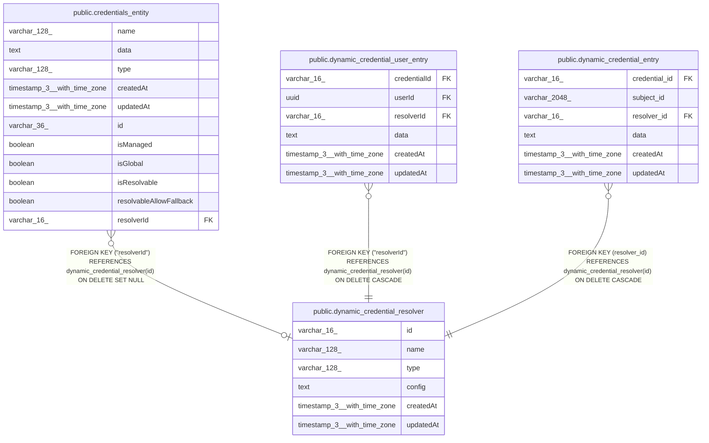

# public.dynamic_credential_resolver

## Columns

| Name | Type | Default | Nullable | Children | Parents | Comment |
| ---- | ---- | ------- | -------- | -------- | ------- | ------- |
| id | varchar(16) |  | false | [public.credentials_entity](public.credentials_entity.md) [public.dynamic_credential_user_entry](public.dynamic_credential_user_entry.md) [public.dynamic_credential_entry](public.dynamic_credential_entry.md) |  |  |
| name | varchar(128) |  | false |  |  |  |
| type | varchar(128) |  | false |  |  |  |
| config | text |  | false |  |  | Encrypted resolver configuration (JSON encrypted as string) |
| createdAt | timestamp(3) with time zone | CURRENT_TIMESTAMP(3) | false |  |  |  |
| updatedAt | timestamp(3) with time zone | CURRENT_TIMESTAMP(3) | false |  |  |  |

## Constraints

| Name | Type | Definition |
| ---- | ---- | ---------- |
| dynamic_credential_resolver_config_not_null | n | NOT NULL config |
| dynamic_credential_resolver_createdAt_not_null | n | NOT NULL "createdAt" |
| dynamic_credential_resolver_id_not_null | n | NOT NULL id |
| dynamic_credential_resolver_name_not_null | n | NOT NULL name |
| dynamic_credential_resolver_type_not_null | n | NOT NULL type |
| dynamic_credential_resolver_updatedAt_not_null | n | NOT NULL "updatedAt" |
| PK_b76cfb088dcdaf5275e9980bb64 | PRIMARY KEY | PRIMARY KEY (id) |

## Indexes

| Name | Definition |
| ---- | ---------- |
| PK_b76cfb088dcdaf5275e9980bb64 | CREATE UNIQUE INDEX "PK_b76cfb088dcdaf5275e9980bb64" ON public.dynamic_credential_resolver USING btree (id) |
| IDX_9c9ee9df586e60bb723234e499 | CREATE INDEX "IDX_9c9ee9df586e60bb723234e499" ON public.dynamic_credential_resolver USING btree (type) |

## Relations

---

> Generated by [tbls](https://github.com/k1LoW/tbls)
