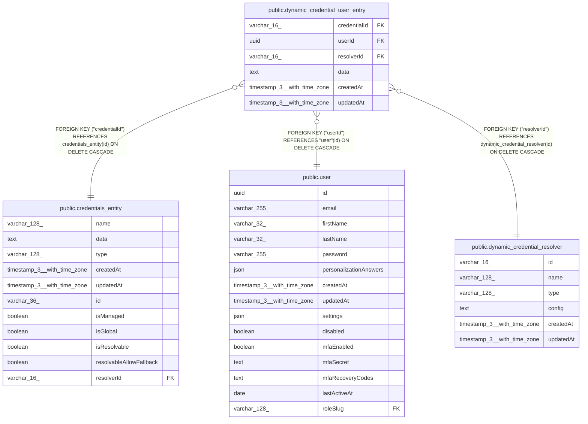

# public.dynamic_credential_user_entry

## Columns

| Name | Type | Default | Nullable | Children | Parents | Comment |
| ---- | ---- | ------- | -------- | -------- | ------- | ------- |
| credentialId | varchar(16) |  | false |  | [public.credentials_entity](public.credentials_entity.md) |  |
| userId | uuid |  | false |  | [public.user](public.user.md) |  |
| resolverId | varchar(16) |  | false |  | [public.dynamic_credential_resolver](public.dynamic_credential_resolver.md) |  |
| data | text |  | false |  |  |  |
| createdAt | timestamp(3) with time zone | CURRENT_TIMESTAMP(3) | false |  |  |  |
| updatedAt | timestamp(3) with time zone | CURRENT_TIMESTAMP(3) | false |  |  |  |

## Constraints

| Name | Type | Definition |
| ---- | ---- | ---------- |
| dynamic_credential_user_entry_createdAt_not_null | n | NOT NULL "createdAt" |
| dynamic_credential_user_entry_credentialId_not_null | n | NOT NULL "credentialId" |
| dynamic_credential_user_entry_data_not_null | n | NOT NULL data |
| dynamic_credential_user_entry_resolverId_not_null | n | NOT NULL "resolverId" |
| dynamic_credential_user_entry_updatedAt_not_null | n | NOT NULL "updatedAt" |
| dynamic_credential_user_entry_userId_not_null | n | NOT NULL "userId" |
| FK_a36dc616fabc3f736bb82410a22 | FOREIGN KEY | FOREIGN KEY ("userId") REFERENCES "user"(id) ON DELETE CASCADE |
| FK_945ba70b342a066d1306b12ccd2 | FOREIGN KEY | FOREIGN KEY ("credentialId") REFERENCES credentials_entity(id) ON DELETE CASCADE |
| FK_6edec973a6450990977bb854c38 | FOREIGN KEY | FOREIGN KEY ("resolverId") REFERENCES dynamic_credential_resolver(id) ON DELETE CASCADE |
| PK_74f548e633abc66dc27c8f0ca77 | PRIMARY KEY | PRIMARY KEY ("credentialId", "userId", "resolverId") |

## Indexes

| Name | Definition |
| ---- | ---------- |
| PK_74f548e633abc66dc27c8f0ca77 | CREATE UNIQUE INDEX "PK_74f548e633abc66dc27c8f0ca77" ON public.dynamic_credential_user_entry USING btree ("credentialId", "userId", "resolverId") |
| IDX_a36dc616fabc3f736bb82410a2 | CREATE INDEX "IDX_a36dc616fabc3f736bb82410a2" ON public.dynamic_credential_user_entry USING btree ("userId") |
| IDX_6edec973a6450990977bb854c3 | CREATE INDEX "IDX_6edec973a6450990977bb854c3" ON public.dynamic_credential_user_entry USING btree ("resolverId") |

## Relations

---

> Generated by [tbls](https://github.com/k1LoW/tbls)
