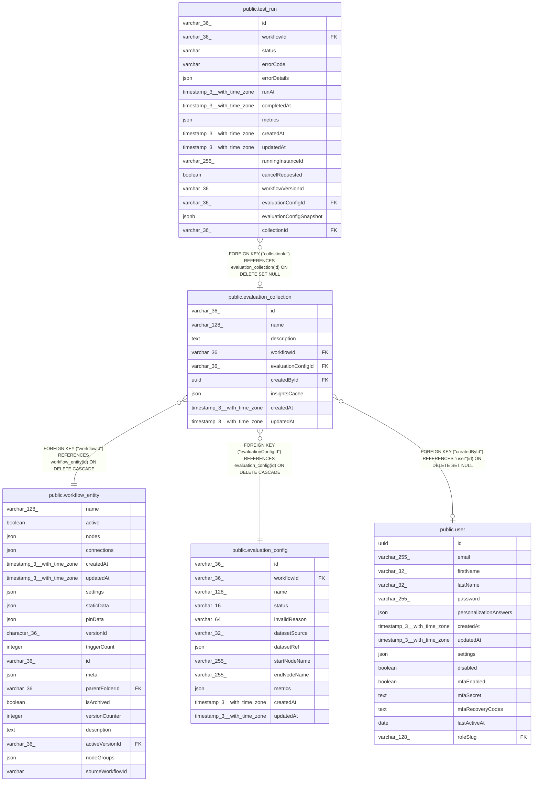

# public.evaluation_collection

## Columns

| Name | Type | Default | Nullable | Children | Parents | Comment |
| ---- | ---- | ------- | -------- | -------- | ------- | ------- |
| id | varchar(36) |  | false | [public.test_run](public.test_run.md) |  |  |
| name | varchar(128) |  | false |  |  |  |
| description | text |  | true |  |  |  |
| workflowId | varchar(36) |  | false |  | [public.workflow_entity](public.workflow_entity.md) |  |
| evaluationConfigId | varchar(36) |  | false |  | [public.evaluation_config](public.evaluation_config.md) |  |
| createdById | uuid |  | true |  | [public.user](public.user.md) |  |
| insightsCache | json |  | true |  |  |  |
| createdAt | timestamp(3) with time zone | CURRENT_TIMESTAMP(3) | false |  |  |  |
| updatedAt | timestamp(3) with time zone | CURRENT_TIMESTAMP(3) | false |  |  |  |

## Constraints

| Name | Type | Definition |
| ---- | ---- | ---------- |
| evaluation_collection_createdAt_not_null | n | NOT NULL "createdAt" |
| evaluation_collection_evaluationConfigId_not_null | n | NOT NULL "evaluationConfigId" |
| evaluation_collection_id_not_null | n | NOT NULL id |
| evaluation_collection_name_not_null | n | NOT NULL name |
| evaluation_collection_updatedAt_not_null | n | NOT NULL "updatedAt" |
| evaluation_collection_workflowId_not_null | n | NOT NULL "workflowId" |
| FK_f4561f38b5a22a4f090d5cd3eae | FOREIGN KEY | FOREIGN KEY ("createdById") REFERENCES "user"(id) ON DELETE SET NULL |
| FK_a48ce930c3bc7604894b8f0eaad | FOREIGN KEY | FOREIGN KEY ("workflowId") REFERENCES workflow_entity(id) ON DELETE CASCADE |
| FK_d634a0c93fd7de68a87eab951b2 | FOREIGN KEY | FOREIGN KEY ("evaluationConfigId") REFERENCES evaluation_config(id) ON DELETE CASCADE |
| PK_e720b6efc1e45b878ebb0b2ca30 | PRIMARY KEY | PRIMARY KEY (id) |

## Indexes

| Name | Definition |
| ---- | ---------- |
| PK_e720b6efc1e45b878ebb0b2ca30 | CREATE UNIQUE INDEX "PK_e720b6efc1e45b878ebb0b2ca30" ON public.evaluation_collection USING btree (id) |
| IDX_a48ce930c3bc7604894b8f0eaa | CREATE INDEX "IDX_a48ce930c3bc7604894b8f0eaa" ON public.evaluation_collection USING btree ("workflowId") |
| IDX_d634a0c93fd7de68a87eab951b | CREATE INDEX "IDX_d634a0c93fd7de68a87eab951b" ON public.evaluation_collection USING btree ("evaluationConfigId") |

## Relations

---

> Generated by [tbls](https://github.com/k1LoW/tbls)
