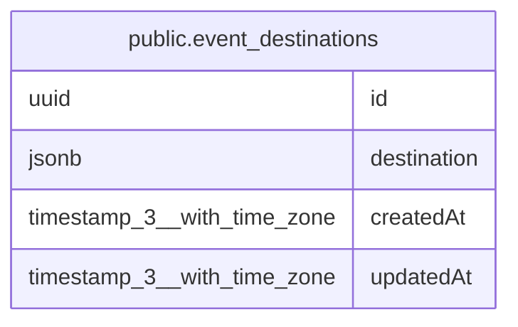

# public.event_destinations

## Columns

| Name | Type | Default | Nullable | Children | Parents | Comment |
| ---- | ---- | ------- | -------- | -------- | ------- | ------- |
| id | uuid |  | false |  |  |  |
| destination | jsonb |  | false |  |  |  |
| createdAt | timestamp(3) with time zone | CURRENT_TIMESTAMP(3) | false |  |  |  |
| updatedAt | timestamp(3) with time zone | CURRENT_TIMESTAMP(3) | false |  |  |  |

## Constraints

| Name | Type | Definition |
| ---- | ---- | ---------- |
| event_destinations_createdAt_not_null | n | NOT NULL "createdAt" |
| event_destinations_destination_not_null | n | NOT NULL destination |
| event_destinations_id_not_null | n | NOT NULL id |
| event_destinations_updatedAt_not_null | n | NOT NULL "updatedAt" |
| event_destinations_pkey | PRIMARY KEY | PRIMARY KEY (id) |

## Indexes

| Name | Definition |
| ---- | ---------- |
| event_destinations_pkey | CREATE UNIQUE INDEX event_destinations_pkey ON public.event_destinations USING btree (id) |

## Relations

---

> Generated by [tbls](https://github.com/k1LoW/tbls)
