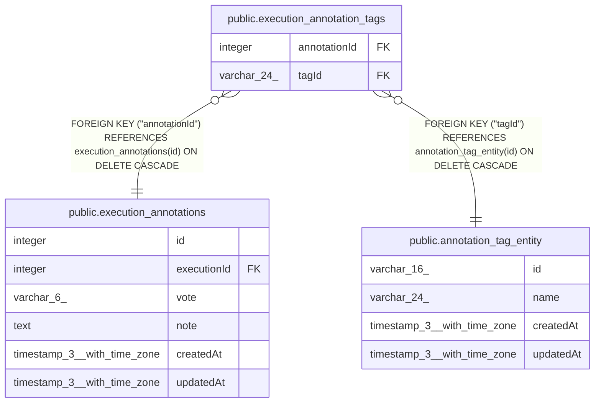

# public.execution_annotation_tags

## Columns

| Name | Type | Default | Nullable | Children | Parents | Comment |
| ---- | ---- | ------- | -------- | -------- | ------- | ------- |
| annotationId | integer |  | false |  | [public.execution_annotations](public.execution_annotations.md) |  |
| tagId | varchar(24) |  | false |  | [public.annotation_tag_entity](public.annotation_tag_entity.md) |  |

## Constraints

| Name | Type | Definition |
| ---- | ---- | ---------- |
| execution_annotation_tags_annotationId_not_null | n | NOT NULL "annotationId" |
| execution_annotation_tags_tagId_not_null | n | NOT NULL "tagId" |
| FK_c1519757391996eb06064f0e7c8 | FOREIGN KEY | FOREIGN KEY ("annotationId") REFERENCES execution_annotations(id) ON DELETE CASCADE |
| FK_a3697779b366e131b2bbdae2976 | FOREIGN KEY | FOREIGN KEY ("tagId") REFERENCES annotation_tag_entity(id) ON DELETE CASCADE |
| PK_979ec03d31294cca484be65d11f | PRIMARY KEY | PRIMARY KEY ("annotationId", "tagId") |

## Indexes

| Name | Definition |
| ---- | ---------- |
| PK_979ec03d31294cca484be65d11f | CREATE UNIQUE INDEX "PK_979ec03d31294cca484be65d11f" ON public.execution_annotation_tags USING btree ("annotationId", "tagId") |
| IDX_a3697779b366e131b2bbdae297 | CREATE INDEX "IDX_a3697779b366e131b2bbdae297" ON public.execution_annotation_tags USING btree ("tagId") |
| IDX_c1519757391996eb06064f0e7c | CREATE INDEX "IDX_c1519757391996eb06064f0e7c" ON public.execution_annotation_tags USING btree ("annotationId") |

## Relations

---

> Generated by [tbls](https://github.com/k1LoW/tbls)
