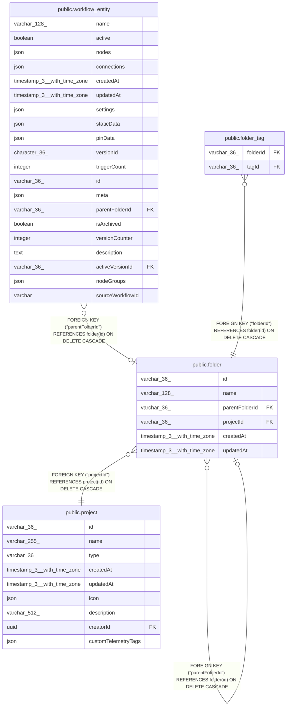

# public.folder

## Columns

| Name | Type | Default | Nullable | Children | Parents | Comment |
| ---- | ---- | ------- | -------- | -------- | ------- | ------- |
| id | varchar(36) |  | false | [public.workflow_entity](public.workflow_entity.md) [public.folder](public.folder.md) [public.folder_tag](public.folder_tag.md) |  |  |
| name | varchar(128) |  | false |  |  |  |
| parentFolderId | varchar(36) |  | true |  | [public.folder](public.folder.md) |  |
| projectId | varchar(36) |  | false |  | [public.project](public.project.md) |  |
| createdAt | timestamp(3) with time zone | CURRENT_TIMESTAMP(3) | false |  |  |  |
| updatedAt | timestamp(3) with time zone | CURRENT_TIMESTAMP(3) | false |  |  |  |

## Constraints

| Name | Type | Definition |
| ---- | ---- | ---------- |
| folder_createdAt_not_null | n | NOT NULL "createdAt" |
| folder_id_not_null | n | NOT NULL id |
| folder_name_not_null | n | NOT NULL name |
| folder_projectId_not_null | n | NOT NULL "projectId" |
| folder_updatedAt_not_null | n | NOT NULL "updatedAt" |
| FK_a8260b0b36939c6247f385b8221 | FOREIGN KEY | FOREIGN KEY ("projectId") REFERENCES project(id) ON DELETE CASCADE |
| FK_804ea52f6729e3940498bd54d78 | FOREIGN KEY | FOREIGN KEY ("parentFolderId") REFERENCES folder(id) ON DELETE CASCADE |
| PK_6278a41a706740c94c02e288df8 | PRIMARY KEY | PRIMARY KEY (id) |

## Indexes

| Name | Definition |
| ---- | ---------- |
| PK_6278a41a706740c94c02e288df8 | CREATE UNIQUE INDEX "PK_6278a41a706740c94c02e288df8" ON public.folder USING btree (id) |
| IDX_14f68deffaf858465715995508 | CREATE UNIQUE INDEX "IDX_14f68deffaf858465715995508" ON public.folder USING btree ("projectId", id) |

## Relations

---

> Generated by [tbls](https://github.com/k1LoW/tbls)
