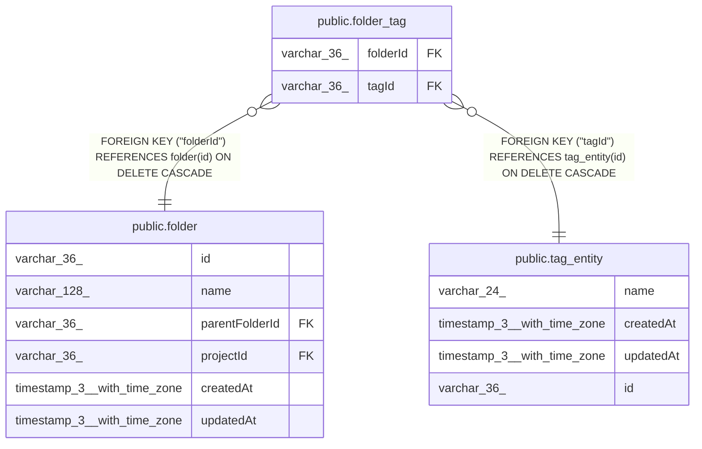

# public.folder_tag

## Columns

| Name | Type | Default | Nullable | Children | Parents | Comment |
| ---- | ---- | ------- | -------- | -------- | ------- | ------- |
| folderId | varchar(36) |  | false |  | [public.folder](public.folder.md) |  |
| tagId | varchar(36) |  | false |  | [public.tag_entity](public.tag_entity.md) |  |

## Constraints

| Name | Type | Definition |
| ---- | ---- | ---------- |
| folder_tag_folderId_not_null | n | NOT NULL "folderId" |
| folder_tag_tagId_not_null | n | NOT NULL "tagId" |
| FK_dc88164176283de80af47621746 | FOREIGN KEY | FOREIGN KEY ("tagId") REFERENCES tag_entity(id) ON DELETE CASCADE |
| FK_94a60854e06f2897b2e0d39edba | FOREIGN KEY | FOREIGN KEY ("folderId") REFERENCES folder(id) ON DELETE CASCADE |
| PK_27e4e00852f6b06a925a4d83a3e | PRIMARY KEY | PRIMARY KEY ("folderId", "tagId") |

## Indexes

| Name | Definition |
| ---- | ---------- |
| PK_27e4e00852f6b06a925a4d83a3e | CREATE UNIQUE INDEX "PK_27e4e00852f6b06a925a4d83a3e" ON public.folder_tag USING btree ("folderId", "tagId") |

## Relations

---

> Generated by [tbls](https://github.com/k1LoW/tbls)
