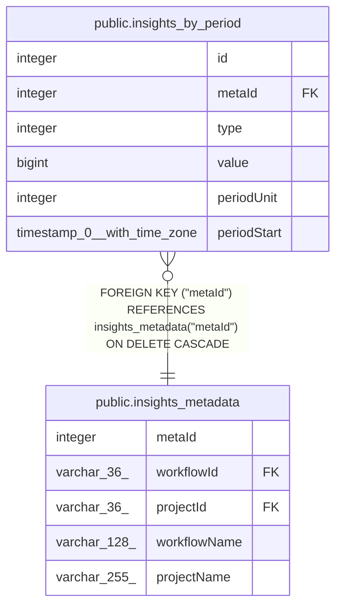

# public.insights_by_period

## Columns

| Name | Type | Default | Nullable | Children | Parents | Comment |
| ---- | ---- | ------- | -------- | -------- | ------- | ------- |
| id | integer |  | false |  |  |  |
| metaId | integer |  | false |  | [public.insights_metadata](public.insights_metadata.md) |  |
| type | integer |  | false |  |  | 0: time_saved_minutes, 1: runtime_milliseconds, 2: success, 3: failure |
| value | bigint |  | false |  |  |  |
| periodUnit | integer |  | false |  |  | 0: hour, 1: day, 2: week |
| periodStart | timestamp(0) with time zone | CURRENT_TIMESTAMP | true |  |  |  |

## Constraints

| Name | Type | Definition |
| ---- | ---- | ---------- |
| insights_by_period_id_not_null | n | NOT NULL id |
| insights_by_period_metaId_not_null | n | NOT NULL "metaId" |
| insights_by_period_periodUnit_not_null | n | NOT NULL "periodUnit" |
| insights_by_period_type_not_null | n | NOT NULL type |
| insights_by_period_value_not_null | n | NOT NULL value |
| FK_6414cfed98daabbfdd61a1cfbc0 | FOREIGN KEY | FOREIGN KEY ("metaId") REFERENCES insights_metadata("metaId") ON DELETE CASCADE |
| PK_b606942249b90cc39b0265f0575 | PRIMARY KEY | PRIMARY KEY (id) |

## Indexes

| Name | Definition |
| ---- | ---------- |
| PK_b606942249b90cc39b0265f0575 | CREATE UNIQUE INDEX "PK_b606942249b90cc39b0265f0575" ON public.insights_by_period USING btree (id) |
| IDX_60b6a84299eeb3f671dfec7693 | CREATE UNIQUE INDEX "IDX_60b6a84299eeb3f671dfec7693" ON public.insights_by_period USING btree ("periodStart", type, "periodUnit", "metaId") |

## Relations

---

> Generated by [tbls](https://github.com/k1LoW/tbls)
