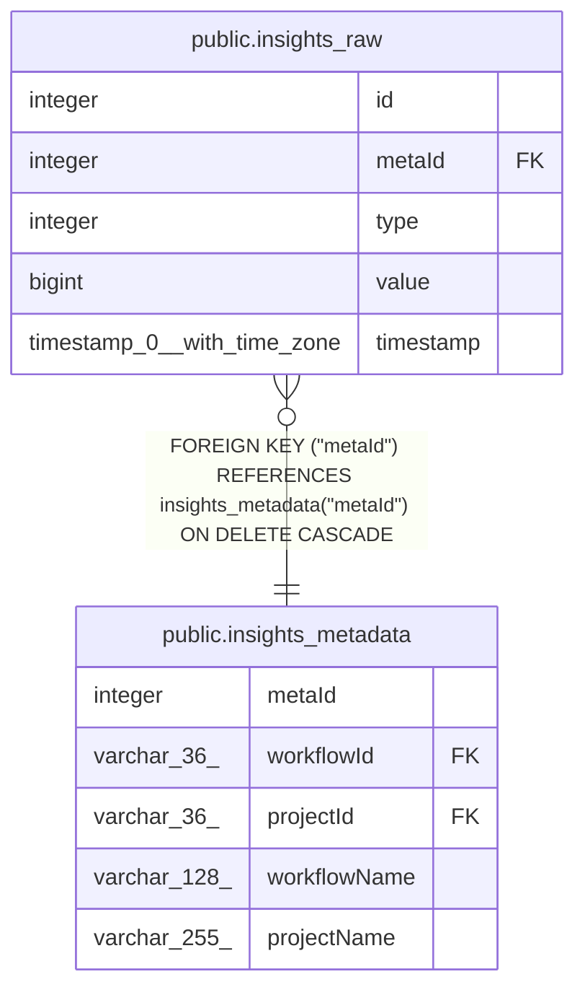

# public.insights_raw

## Columns

| Name | Type | Default | Nullable | Children | Parents | Comment |
| ---- | ---- | ------- | -------- | -------- | ------- | ------- |
| id | integer |  | false |  |  |  |
| metaId | integer |  | false |  | [public.insights_metadata](public.insights_metadata.md) |  |
| type | integer |  | false |  |  | 0: time_saved_minutes, 1: runtime_milliseconds, 2: success, 3: failure |
| value | bigint |  | false |  |  |  |
| timestamp | timestamp(0) with time zone | CURRENT_TIMESTAMP | false |  |  |  |

## Constraints

| Name | Type | Definition |
| ---- | ---- | ---------- |
| insights_raw_id_not_null | n | NOT NULL id |
| insights_raw_metaId_not_null | n | NOT NULL "metaId" |
| insights_raw_timestamp_not_null | n | NOT NULL "timestamp" |
| insights_raw_type_not_null | n | NOT NULL type |
| insights_raw_value_not_null | n | NOT NULL value |
| FK_6e2e33741adef2a7c5d66befa4e | FOREIGN KEY | FOREIGN KEY ("metaId") REFERENCES insights_metadata("metaId") ON DELETE CASCADE |
| PK_ec15125755151e3a7e00e00014f | PRIMARY KEY | PRIMARY KEY (id) |

## Indexes

| Name | Definition |
| ---- | ---------- |
| PK_ec15125755151e3a7e00e00014f | CREATE UNIQUE INDEX "PK_ec15125755151e3a7e00e00014f" ON public.insights_raw USING btree (id) |
| IDX_insights_raw_timestamp_id | CREATE INDEX "IDX_insights_raw_timestamp_id" ON public.insights_raw USING btree ("timestamp", id) |

## Relations

---

> Generated by [tbls](https://github.com/k1LoW/tbls)
