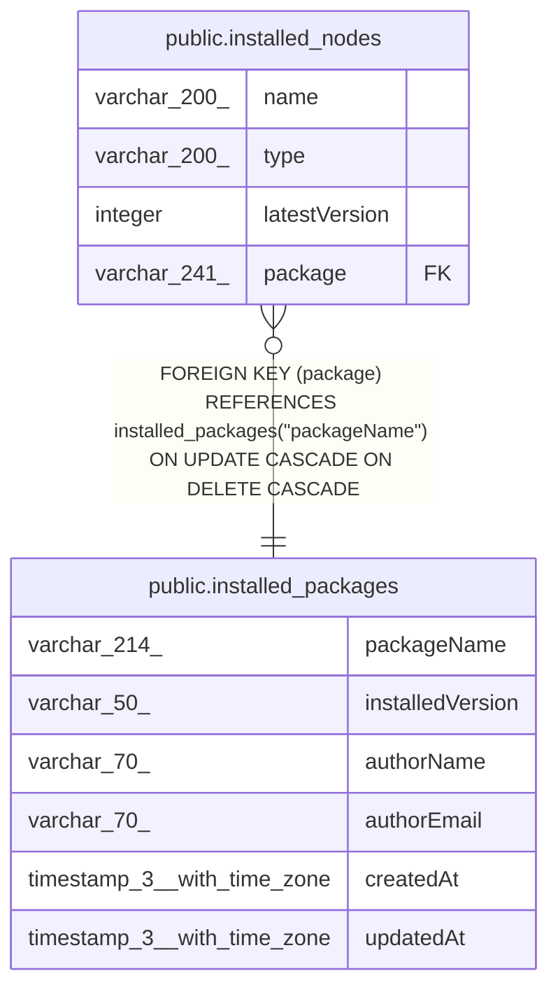

# public.installed_packages

## Columns

| Name | Type | Default | Nullable | Children | Parents | Comment |
| ---- | ---- | ------- | -------- | -------- | ------- | ------- |
| packageName | varchar(214) |  | false | [public.installed_nodes](public.installed_nodes.md) |  |  |
| installedVersion | varchar(50) |  | false |  |  |  |
| authorName | varchar(70) |  | true |  |  |  |
| authorEmail | varchar(70) |  | true |  |  |  |
| createdAt | timestamp(3) with time zone | CURRENT_TIMESTAMP(3) | false |  |  |  |
| updatedAt | timestamp(3) with time zone | CURRENT_TIMESTAMP(3) | false |  |  |  |

## Constraints

| Name | Type | Definition |
| ---- | ---- | ---------- |
| installed_packages_createdAt_not_null | n | NOT NULL "createdAt" |
| installed_packages_installedVersion_not_null | n | NOT NULL "installedVersion" |
| installed_packages_packageName_not_null | n | NOT NULL "packageName" |
| installed_packages_updatedAt_not_null | n | NOT NULL "updatedAt" |
| PK_08cc9197c39b028c1e9beca225940576fd1a5804 | PRIMARY KEY | PRIMARY KEY ("packageName") |

## Indexes

| Name | Definition |
| ---- | ---------- |
| PK_08cc9197c39b028c1e9beca225940576fd1a5804 | CREATE UNIQUE INDEX "PK_08cc9197c39b028c1e9beca225940576fd1a5804" ON public.installed_packages USING btree ("packageName") |

## Relations

---

> Generated by [tbls](https://github.com/k1LoW/tbls)
