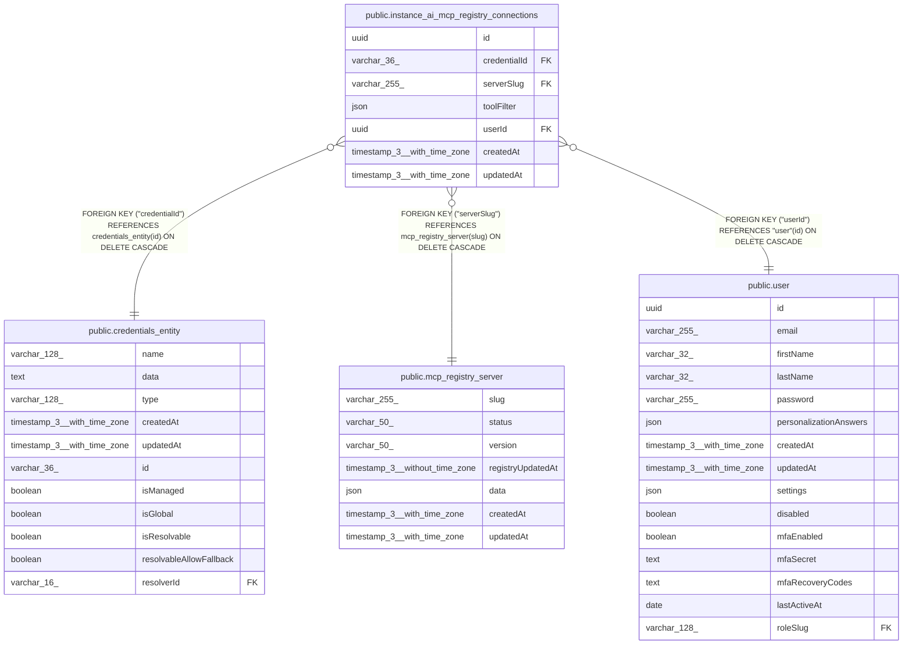

# public.instance_ai_mcp_registry_connections

## Columns

| Name | Type | Default | Nullable | Children | Parents | Comment |
| ---- | ---- | ------- | -------- | -------- | ------- | ------- |
| id | uuid |  | false |  |  |  |
| credentialId | varchar(36) |  | false |  | [public.credentials_entity](public.credentials_entity.md) |  |
| serverSlug | varchar(255) |  | false |  | [public.mcp_registry_server](public.mcp_registry_server.md) |  |
| toolFilter | json |  | true |  |  | Optional MCP tool filter per registry connection: { mode: "allow" \| "exclude", tools: string[] } |
| userId | uuid |  | false |  | [public.user](public.user.md) |  |
| createdAt | timestamp(3) with time zone | CURRENT_TIMESTAMP(3) | false |  |  |  |
| updatedAt | timestamp(3) with time zone | CURRENT_TIMESTAMP(3) | false |  |  |  |

## Constraints

| Name | Type | Definition |
| ---- | ---- | ---------- |
| instance_ai_mcp_registry_connections_createdAt_not_null | n | NOT NULL "createdAt" |
| instance_ai_mcp_registry_connections_credentialId_not_null | n | NOT NULL "credentialId" |
| instance_ai_mcp_registry_connections_id_not_null | n | NOT NULL id |
| instance_ai_mcp_registry_connections_serverSlug_not_null | n | NOT NULL "serverSlug" |
| instance_ai_mcp_registry_connections_updatedAt_not_null | n | NOT NULL "updatedAt" |
| instance_ai_mcp_registry_connections_userId_not_null | n | NOT NULL "userId" |
| FK_8b42c08a531d76410980c639a5b | FOREIGN KEY | FOREIGN KEY ("userId") REFERENCES "user"(id) ON DELETE CASCADE |
| FK_1e826120e7e53ebc4681f026de8 | FOREIGN KEY | FOREIGN KEY ("credentialId") REFERENCES credentials_entity(id) ON DELETE CASCADE |
| FK_1d25707354d2012da256eb2ec0a | FOREIGN KEY | FOREIGN KEY ("serverSlug") REFERENCES mcp_registry_server(slug) ON DELETE CASCADE |
| PK_e34e4d15d78eabbe8217e33ef03 | PRIMARY KEY | PRIMARY KEY (id) |

## Indexes

| Name | Definition |
| ---- | ---------- |
| PK_e34e4d15d78eabbe8217e33ef03 | CREATE UNIQUE INDEX "PK_e34e4d15d78eabbe8217e33ef03" ON public.instance_ai_mcp_registry_connections USING btree (id) |
| IDX_16db3adb7b19df1ee55ff06b27 | CREATE UNIQUE INDEX "IDX_16db3adb7b19df1ee55ff06b27" ON public.instance_ai_mcp_registry_connections USING btree ("userId", "serverSlug", "credentialId") |

## Relations

---

> Generated by [tbls](https://github.com/k1LoW/tbls)
