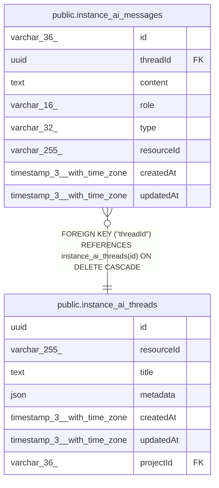

# public.instance_ai_messages

## Columns

| Name | Type | Default | Nullable | Children | Parents | Comment |
| ---- | ---- | ------- | -------- | -------- | ------- | ------- |
| id | varchar(36) |  | false |  |  |  |
| threadId | uuid |  | false |  | [public.instance_ai_threads](public.instance_ai_threads.md) |  |
| content | text |  | false |  |  |  |
| role | varchar(16) |  | false |  |  |  |
| type | varchar(32) |  | true |  |  |  |
| resourceId | varchar(255) |  | true |  |  |  |
| createdAt | timestamp(3) with time zone | CURRENT_TIMESTAMP(3) | false |  |  |  |
| updatedAt | timestamp(3) with time zone | CURRENT_TIMESTAMP(3) | false |  |  |  |

## Constraints

| Name | Type | Definition |
| ---- | ---- | ---------- |
| instance_ai_messages_content_not_null | n | NOT NULL content |
| instance_ai_messages_createdAt_not_null | n | NOT NULL "createdAt" |
| instance_ai_messages_id_not_null | n | NOT NULL id |
| instance_ai_messages_role_not_null | n | NOT NULL role |
| instance_ai_messages_threadId_not_null | n | NOT NULL "threadId" |
| instance_ai_messages_updatedAt_not_null | n | NOT NULL "updatedAt" |
| FK_1eeb64cb9d66a927988de759e6e | FOREIGN KEY | FOREIGN KEY ("threadId") REFERENCES instance_ai_threads(id) ON DELETE CASCADE |
| PK_156c6f287225e9befe0181bb02b | PRIMARY KEY | PRIMARY KEY (id) |

## Indexes

| Name | Definition |
| ---- | ---------- |
| PK_156c6f287225e9befe0181bb02b | CREATE UNIQUE INDEX "PK_156c6f287225e9befe0181bb02b" ON public.instance_ai_messages USING btree (id) |
| IDX_1eeb64cb9d66a927988de759e6 | CREATE INDEX "IDX_1eeb64cb9d66a927988de759e6" ON public.instance_ai_messages USING btree ("threadId") |
| IDX_76e212c6867fbaa06bf0decd6f | CREATE INDEX "IDX_76e212c6867fbaa06bf0decd6f" ON public.instance_ai_messages USING btree ("resourceId") |

## Relations

---

> Generated by [tbls](https://github.com/k1LoW/tbls)
