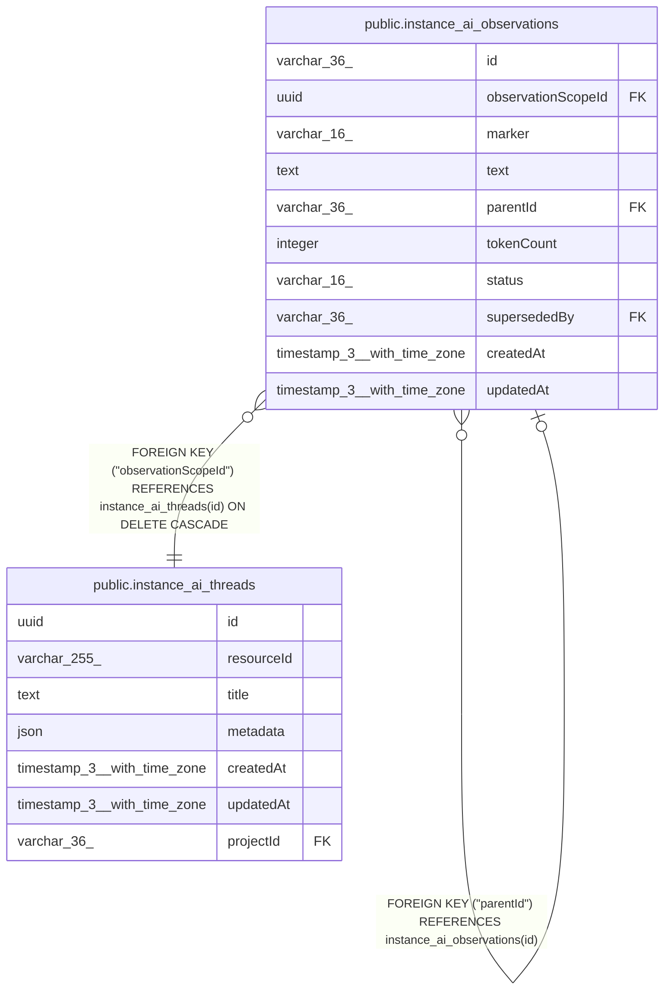

# public.instance_ai_observations

## Columns

| Name | Type | Default | Nullable | Children | Parents | Comment |
| ---- | ---- | ------- | -------- | -------- | ------- | ------- |
| id | varchar(36) |  | false | [public.instance_ai_observations](public.instance_ai_observations.md) |  | Application-generated n8n string ID, not a database UUID |
| observationScopeId | uuid |  | false |  | [public.instance_ai_threads](public.instance_ai_threads.md) | instance_ai_threads.id source stream for this observation log |
| marker | varchar(16) |  | false |  |  |  |
| text | text |  | false |  |  |  |
| parentId | varchar(36) |  | true |  | [public.instance_ai_observations](public.instance_ai_observations.md) |  |
| tokenCount | integer | 0 | false |  |  |  |
| status | varchar(16) |  | false |  |  |  |
| supersededBy | varchar(36) |  | true |  | [public.instance_ai_observations](public.instance_ai_observations.md) |  |
| createdAt | timestamp(3) with time zone | CURRENT_TIMESTAMP(3) | false |  |  |  |
| updatedAt | timestamp(3) with time zone | CURRENT_TIMESTAMP(3) | false |  |  |  |

## Constraints

| Name | Type | Definition |
| ---- | ---- | ---------- |
| CHK_instance_ai_observations_marker | CHECK | CHECK (((marker)::text = ANY ((ARRAY['critical'::character varying, 'important'::character varying, 'info'::character varying, 'completion'::character varying])::text[]))) |
| CHK_instance_ai_observations_status | CHECK | CHECK (((status)::text = ANY ((ARRAY['active'::character varying, 'superseded'::character varying, 'dropped'::character varying])::text[]))) |
| instance_ai_observations_createdAt_not_null | n | NOT NULL "createdAt" |
| instance_ai_observations_id_not_null | n | NOT NULL id |
| instance_ai_observations_marker_not_null | n | NOT NULL marker |
| instance_ai_observations_observationScopeId_not_null | n | NOT NULL "observationScopeId" |
| instance_ai_observations_status_not_null | n | NOT NULL status |
| instance_ai_observations_text_not_null | n | NOT NULL text |
| instance_ai_observations_tokenCount_not_null | n | NOT NULL "tokenCount" |
| instance_ai_observations_updatedAt_not_null | n | NOT NULL "updatedAt" |
| FK_d54fc84a6c8ac91b5e0db0378a4 | FOREIGN KEY | FOREIGN KEY ("observationScopeId") REFERENCES instance_ai_threads(id) ON DELETE CASCADE |
| FK_a80e0ee839a2f10ba4b86e19998 | FOREIGN KEY | FOREIGN KEY ("supersededBy") REFERENCES instance_ai_observations(id) |
| FK_daef2195a4a846eb70eed15e039 | FOREIGN KEY | FOREIGN KEY ("parentId") REFERENCES instance_ai_observations(id) |
| PK_4d9b514cdf0f0b577650caf2ac2 | PRIMARY KEY | PRIMARY KEY (id) |

## Indexes

| Name | Definition |
| ---- | ---------- |
| PK_4d9b514cdf0f0b577650caf2ac2 | CREATE UNIQUE INDEX "PK_4d9b514cdf0f0b577650caf2ac2" ON public.instance_ai_observations USING btree (id) |
| IDX_0d5db648188d338df7fb2a8064 | CREATE INDEX "IDX_0d5db648188d338df7fb2a8064" ON public.instance_ai_observations USING btree ("observationScopeId", status, "createdAt", id) |
| IDX_daef2195a4a846eb70eed15e03 | CREATE INDEX "IDX_daef2195a4a846eb70eed15e03" ON public.instance_ai_observations USING btree ("parentId") |
| IDX_a80e0ee839a2f10ba4b86e1999 | CREATE INDEX "IDX_a80e0ee839a2f10ba4b86e1999" ON public.instance_ai_observations USING btree ("supersededBy") |

## Relations

---

> Generated by [tbls](https://github.com/k1LoW/tbls)
