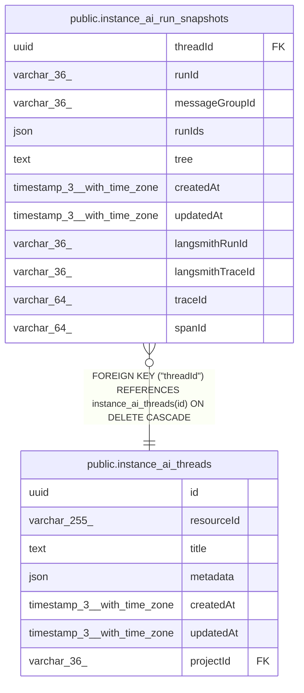

# public.instance_ai_run_snapshots

## Columns

| Name | Type | Default | Nullable | Children | Parents | Comment |
| ---- | ---- | ------- | -------- | -------- | ------- | ------- |
| threadId | uuid |  | false |  | [public.instance_ai_threads](public.instance_ai_threads.md) |  |
| runId | varchar(36) |  | false |  |  |  |
| messageGroupId | varchar(36) |  | true |  |  |  |
| runIds | json |  | true |  |  |  |
| tree | text |  | false |  |  |  |
| createdAt | timestamp(3) with time zone | CURRENT_TIMESTAMP(3) | false |  |  |  |
| updatedAt | timestamp(3) with time zone | CURRENT_TIMESTAMP(3) | false |  |  |  |
| langsmithRunId | varchar(36) |  | true |  |  | LangSmith run ID (UUID v4, e.g. "f47ac10b-58cc-4372-a567-0e02b2c3d479"). |
| langsmithTraceId | varchar(36) |  | true |  |  | LangSmith trace ID (UUID v4, e.g. "f47ac10b-58cc-4372-a567-0e02b2c3d479"). |
| traceId | varchar(64) |  | true |  |  | OpenTelemetry trace ID for the root Instance AI run. |
| spanId | varchar(64) |  | true |  |  | OpenTelemetry span ID for the root Instance AI run. |

## Constraints

| Name | Type | Definition |
| ---- | ---- | ---------- |
| instance_ai_run_snapshots_createdAt_not_null | n | NOT NULL "createdAt" |
| instance_ai_run_snapshots_runId_not_null | n | NOT NULL "runId" |
| instance_ai_run_snapshots_threadId_not_null | n | NOT NULL "threadId" |
| instance_ai_run_snapshots_tree_not_null | n | NOT NULL tree |
| instance_ai_run_snapshots_updatedAt_not_null | n | NOT NULL "updatedAt" |
| FK_2f63fa21d09d7918f347ddbdf70 | FOREIGN KEY | FOREIGN KEY ("threadId") REFERENCES instance_ai_threads(id) ON DELETE CASCADE |
| PK_0a5fc9690a84950ebf1416fb146 | PRIMARY KEY | PRIMARY KEY ("threadId", "runId") |

## Indexes

| Name | Definition |
| ---- | ---------- |
| PK_0a5fc9690a84950ebf1416fb146 | CREATE UNIQUE INDEX "PK_0a5fc9690a84950ebf1416fb146" ON public.instance_ai_run_snapshots USING btree ("threadId", "runId") |
| IDX_d926c16c2ad9728cb9a81790c0 | CREATE INDEX "IDX_d926c16c2ad9728cb9a81790c0" ON public.instance_ai_run_snapshots USING btree ("threadId", "messageGroupId") |
| IDX_d3a2bc880e7a8626802e5474ad | CREATE INDEX "IDX_d3a2bc880e7a8626802e5474ad" ON public.instance_ai_run_snapshots USING btree ("threadId", "createdAt") |

## Relations

---

> Generated by [tbls](https://github.com/k1LoW/tbls)
