# public.instance_ai_threads

## Columns

| Name | Type | Default | Nullable | Children | Parents | Comment |
| ---- | ---- | ------- | -------- | -------- | ------- | ------- |
| id | uuid |  | false | [public.instance_ai_messages](public.instance_ai_messages.md) [public.instance_ai_observational_memory](public.instance_ai_observational_memory.md) [public.instance_ai_run_snapshots](public.instance_ai_run_snapshots.md) [public.instance_ai_iteration_logs](public.instance_ai_iteration_logs.md) [public.ai_builder_temporary_workflow](public.ai_builder_temporary_workflow.md) [public.instance_ai_checkpoints](public.instance_ai_checkpoints.md) [public.instance_ai_observations](public.instance_ai_observations.md) [public.instance_ai_observation_cursors](public.instance_ai_observation_cursors.md) [public.instance_ai_observation_locks](public.instance_ai_observation_locks.md) [public.instance_ai_pending_confirmations](public.instance_ai_pending_confirmations.md) |  |  |
| resourceId | varchar(255) |  | false |  |  |  |
| title | text | ''::text | false |  |  |  |
| metadata | json |  | true |  |  |  |
| createdAt | timestamp(3) with time zone | CURRENT_TIMESTAMP(3) | false |  |  |  |
| updatedAt | timestamp(3) with time zone | CURRENT_TIMESTAMP(3) | false |  |  |  |
| projectId | varchar(36) |  | false |  | [public.project](public.project.md) | Project this thread is scoped to |

## Constraints

| Name | Type | Definition |
| ---- | ---- | ---------- |
| instance_ai_threads_createdAt_not_null | n | NOT NULL "createdAt" |
| instance_ai_threads_id_not_null | n | NOT NULL id |
| instance_ai_threads_projectId_not_null | n | NOT NULL "projectId" |
| instance_ai_threads_resourceId_not_null | n | NOT NULL "resourceId" |
| instance_ai_threads_title_not_null | n | NOT NULL title |
| instance_ai_threads_updatedAt_not_null | n | NOT NULL "updatedAt" |
| FK_instance_ai_threads_projectId | FOREIGN KEY | FOREIGN KEY ("projectId") REFERENCES project(id) ON DELETE CASCADE |
| PK_35575100e45cdedeb89ae0643e9 | PRIMARY KEY | PRIMARY KEY (id) |

## Indexes

| Name | Definition |
| ---- | ---------- |
| PK_35575100e45cdedeb89ae0643e9 | CREATE UNIQUE INDEX "PK_35575100e45cdedeb89ae0643e9" ON public.instance_ai_threads USING btree (id) |
| IDX_f36dea4d38fe92e0e8f44d5a56 | CREATE INDEX "IDX_f36dea4d38fe92e0e8f44d5a56" ON public.instance_ai_threads USING btree ("resourceId") |
| IDX_instance_ai_threads_projectId | CREATE INDEX "IDX_instance_ai_threads_projectId" ON public.instance_ai_threads USING btree ("projectId") |

## Relations

```mermaid
erDiagram

"public.instance_ai_messages" }o--|| "public.instance_ai_threads" : "FOREIGN KEY (#quot;threadId#quot;) REFERENCES instance_ai_threads(id) ON DELETE CASCADE"
"public.instance_ai_observational_memory" }o--o| "public.instance_ai_threads" : "FOREIGN KEY (#quot;threadId#quot;) REFERENCES instance_ai_threads(id) ON DELETE SET NULL"
"public.instance_ai_run_snapshots" }o--|| "public.instance_ai_threads" : "FOREIGN KEY (#quot;threadId#quot;) REFERENCES instance_ai_threads(id) ON DELETE CASCADE"
"public.instance_ai_iteration_logs" }o--|| "public.instance_ai_threads" : "FOREIGN KEY (#quot;threadId#quot;) REFERENCES instance_ai_threads(id) ON DELETE CASCADE"
"public.ai_builder_temporary_workflow" }o--|| "public.instance_ai_threads" : "FOREIGN KEY (#quot;threadId#quot;) REFERENCES instance_ai_threads(id) ON DELETE CASCADE"
"public.instance_ai_checkpoints" }o--|| "public.instance_ai_threads" : "FOREIGN KEY (#quot;threadId#quot;) REFERENCES instance_ai_threads(id) ON DELETE CASCADE"
"public.instance_ai_observations" }o--|| "public.instance_ai_threads" : "FOREIGN KEY (#quot;observationScopeId#quot;) REFERENCES instance_ai_threads(id) ON DELETE CASCADE"
"public.instance_ai_observation_cursors" |o--|| "public.instance_ai_threads" : "FOREIGN KEY (#quot;observationScopeId#quot;) REFERENCES instance_ai_threads(id) ON DELETE CASCADE"
"public.instance_ai_observation_locks" }o--|| "public.instance_ai_threads" : "FOREIGN KEY (#quot;observationScopeId#quot;) REFERENCES instance_ai_threads(id) ON DELETE CASCADE"
"public.instance_ai_pending_confirmations" }o--|| "public.instance_ai_threads" : "FOREIGN KEY (#quot;threadId#quot;) REFERENCES instance_ai_threads(id) ON DELETE CASCADE"
"public.instance_ai_threads" }o--|| "public.project" : "FOREIGN KEY (#quot;projectId#quot;) REFERENCES project(id) ON DELETE CASCADE"

"public.instance_ai_threads" {
  uuid id
  varchar_255_ resourceId
  text title
  json metadata
  timestamp_3__with_time_zone createdAt
  timestamp_3__with_time_zone updatedAt
  varchar_36_ projectId FK
}
"public.instance_ai_messages" {
  varchar_36_ id
  uuid threadId FK
  text content
  varchar_16_ role
  varchar_32_ type
  varchar_255_ resourceId
  timestamp_3__with_time_zone createdAt
  timestamp_3__with_time_zone updatedAt
}
"public.instance_ai_observational_memory" {
  varchar_36_ id
  varchar_255_ lookupKey
  varchar_16_ scope
  uuid threadId FK
  varchar_255_ resourceId
  text activeObservations
  varchar_32_ originType
  text config
  integer generationCount
  timestamp_3__with_time_zone lastObservedAt
  integer pendingMessageTokens
  integer totalTokensObserved
  integer observationTokenCount
  boolean isObserving
  boolean isReflecting
  json observedMessageIds
  varchar observedTimezone
  text bufferedObservations
  integer bufferedObservationTokens
  json bufferedMessageIds
  text bufferedReflection
  integer bufferedReflectionTokens
  integer bufferedReflectionInputTokens
  integer reflectedObservationLineCount
  json bufferedObservationChunks
  boolean isBufferingObservation
  boolean isBufferingReflection
  integer lastBufferedAtTokens
  timestamp_3__with_time_zone lastBufferedAtTime
  json metadata
  timestamp_3__with_time_zone createdAt
  timestamp_3__with_time_zone updatedAt
}
"public.instance_ai_run_snapshots" {
  uuid threadId FK
  varchar_36_ runId
  varchar_36_ messageGroupId
  json runIds
  text tree
  timestamp_3__with_time_zone createdAt
  timestamp_3__with_time_zone updatedAt
  varchar_36_ langsmithRunId
  varchar_36_ langsmithTraceId
  varchar_64_ traceId
  varchar_64_ spanId
}
"public.instance_ai_iteration_logs" {
  varchar_36_ id
  uuid threadId FK
  varchar taskKey
  text entry
  timestamp_3__with_time_zone createdAt
  timestamp_3__with_time_zone updatedAt
}
"public.ai_builder_temporary_workflow" {
  varchar_36_ workflowId FK
  uuid threadId FK
  timestamp_3__with_time_zone createdAt
  timestamp_3__with_time_zone updatedAt
}
"public.instance_ai_checkpoints" {
  varchar_255_ key
  varchar_255_ runId
  uuid threadId FK
  varchar_255_ resourceId
  json state
  timestamp_3__with_time_zone createdAt
  timestamp_3__with_time_zone updatedAt
  timestamp_3__with_time_zone expiredAt
}
"public.instance_ai_observations" {
  varchar_36_ id
  uuid observationScopeId FK
  varchar_16_ marker
  text text
  varchar_36_ parentId FK
  integer tokenCount
  varchar_16_ status
  varchar_36_ supersededBy FK
  timestamp_3__with_time_zone createdAt
  timestamp_3__with_time_zone updatedAt
}
"public.instance_ai_observation_cursors" {
  uuid observationScopeId FK
  varchar_36_ lastObservedMessageId
  timestamp_3__with_time_zone lastObservedAt
  timestamp_3__with_time_zone createdAt
  timestamp_3__with_time_zone updatedAt
}
"public.instance_ai_observation_locks" {
  uuid observationScopeId FK
  varchar_20_ taskKind
  varchar_64_ holderId
  timestamp_3__with_time_zone heldUntil
  timestamp_3__with_time_zone createdAt
  timestamp_3__with_time_zone updatedAt
}
"public.instance_ai_pending_confirmations" {
  varchar_36_ requestId
  uuid threadId FK
  uuid userId FK
  varchar_16_ kind
  varchar_36_ runId
  varchar_64_ toolCallId
  varchar_36_ messageGroupId
  varchar_255_ checkpointKey FK
  varchar_36_ checkpointTaskId
  timestamp_3__with_time_zone expiresAt
  timestamp_3__with_time_zone createdAt
  timestamp_3__with_time_zone updatedAt
}
"public.project" {
  varchar_36_ id
  varchar_255_ name
  varchar_36_ type
  timestamp_3__with_time_zone createdAt
  timestamp_3__with_time_zone updatedAt
  json icon
  varchar_512_ description
  uuid creatorId FK
  json customTelemetryTags
}
```

---

> Generated by [tbls](https://github.com/k1LoW/tbls)
