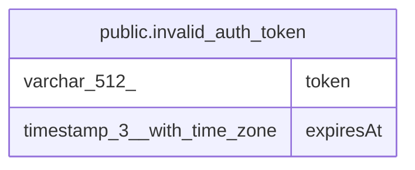

# public.invalid_auth_token

## Columns

| Name | Type | Default | Nullable | Children | Parents | Comment |
| ---- | ---- | ------- | -------- | -------- | ------- | ------- |
| token | varchar(512) |  | false |  |  |  |
| expiresAt | timestamp(3) with time zone |  | false |  |  |  |

## Constraints

| Name | Type | Definition |
| ---- | ---- | ---------- |
| invalid_auth_token_expiresAt_not_null | n | NOT NULL "expiresAt" |
| invalid_auth_token_token_not_null | n | NOT NULL token |
| PK_5779069b7235b256d91f7af1a15 | PRIMARY KEY | PRIMARY KEY (token) |

## Indexes

| Name | Definition |
| ---- | ---------- |
| PK_5779069b7235b256d91f7af1a15 | CREATE UNIQUE INDEX "PK_5779069b7235b256d91f7af1a15" ON public.invalid_auth_token USING btree (token) |

## Relations

---

> Generated by [tbls](https://github.com/k1LoW/tbls)
