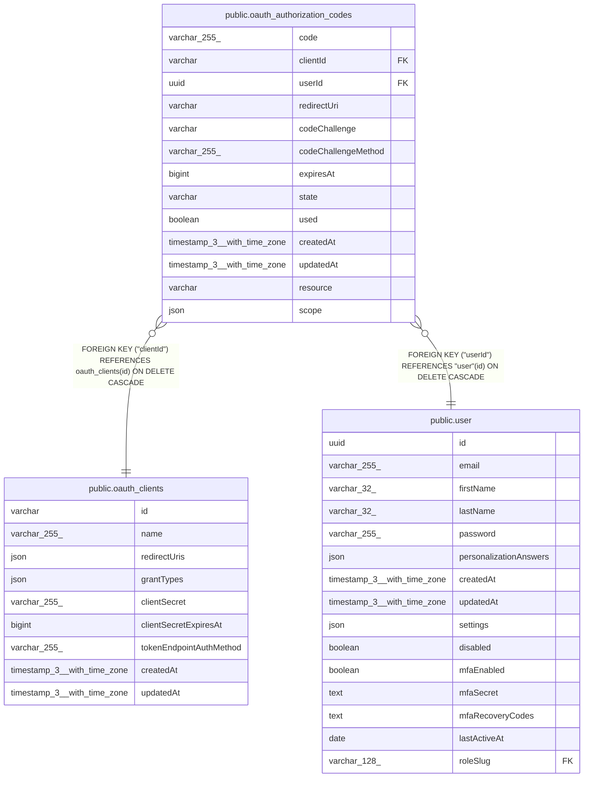

# public.oauth_authorization_codes

## Columns

| Name | Type | Default | Nullable | Children | Parents | Comment |
| ---- | ---- | ------- | -------- | -------- | ------- | ------- |
| code | varchar(255) |  | false |  |  |  |
| clientId | varchar |  | false |  | [public.oauth_clients](public.oauth_clients.md) |  |
| userId | uuid |  | false |  | [public.user](public.user.md) |  |
| redirectUri | varchar |  | false |  |  |  |
| codeChallenge | varchar |  | false |  |  |  |
| codeChallengeMethod | varchar(255) |  | false |  |  |  |
| expiresAt | bigint |  | false |  |  | Unix timestamp in milliseconds |
| state | varchar |  | true |  |  |  |
| used | boolean | false | false |  |  |  |
| createdAt | timestamp(3) with time zone | CURRENT_TIMESTAMP(3) | false |  |  |  |
| updatedAt | timestamp(3) with time zone | CURRENT_TIMESTAMP(3) | false |  |  |  |
| resource | varchar |  | true |  |  | RFC 8707 resource indicator URI (e.g. https://n8n.example.com/mcp-server/http). NULL = legacy flow predating resource indicator support; defaults to the instance canonical MCP resource URL. |
| scope | json | '["tool:listWorkflows","tool:getWorkflowDetails"]'::json | false |  |  | OAuth scopes granted for this authorization code |

## Constraints

| Name | Type | Definition |
| ---- | ---- | ---------- |
| oauth_authorization_codes_clientId_not_null | n | NOT NULL "clientId" |
| oauth_authorization_codes_codeChallengeMethod_not_null | n | NOT NULL "codeChallengeMethod" |
| oauth_authorization_codes_codeChallenge_not_null | n | NOT NULL "codeChallenge" |
| oauth_authorization_codes_code_not_null | n | NOT NULL code |
| oauth_authorization_codes_createdAt_not_null | n | NOT NULL "createdAt" |
| oauth_authorization_codes_expiresAt_not_null | n | NOT NULL "expiresAt" |
| oauth_authorization_codes_redirectUri_not_null | n | NOT NULL "redirectUri" |
| oauth_authorization_codes_scope_not_null | n | NOT NULL scope |
| oauth_authorization_codes_updatedAt_not_null | n | NOT NULL "updatedAt" |
| oauth_authorization_codes_used_not_null | n | NOT NULL used |
| oauth_authorization_codes_userId_not_null | n | NOT NULL "userId" |
| FK_aa8d3560484944c19bdf79ffa16 | FOREIGN KEY | FOREIGN KEY ("userId") REFERENCES "user"(id) ON DELETE CASCADE |
| FK_64d965bd072ea24fb6da55468cd | FOREIGN KEY | FOREIGN KEY ("clientId") REFERENCES oauth_clients(id) ON DELETE CASCADE |
| PK_fb91ab932cfbd694061501cc20f | PRIMARY KEY | PRIMARY KEY (code) |

## Indexes

| Name | Definition |
| ---- | ---------- |
| PK_fb91ab932cfbd694061501cc20f | CREATE UNIQUE INDEX "PK_fb91ab932cfbd694061501cc20f" ON public.oauth_authorization_codes USING btree (code) |

## Relations

---

> Generated by [tbls](https://github.com/k1LoW/tbls)
