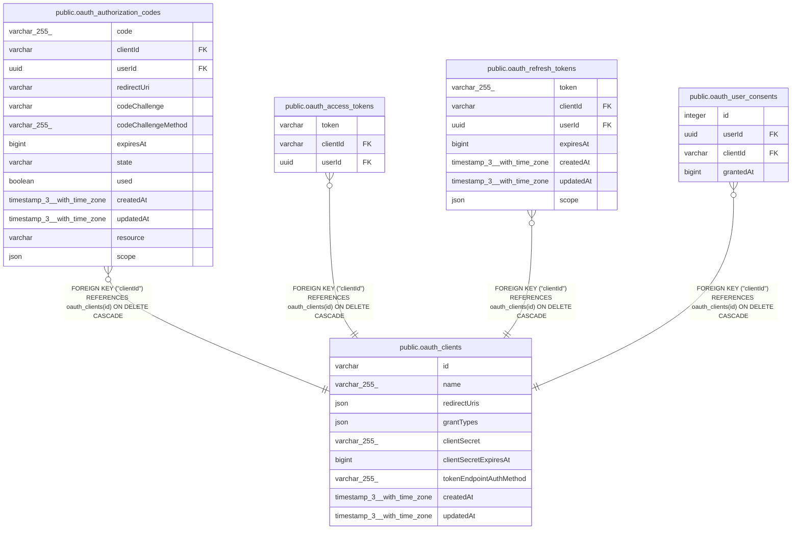

# public.oauth_clients

## Columns

| Name | Type | Default | Nullable | Children | Parents | Comment |
| ---- | ---- | ------- | -------- | -------- | ------- | ------- |
| id | varchar |  | false | [public.oauth_authorization_codes](public.oauth_authorization_codes.md) [public.oauth_access_tokens](public.oauth_access_tokens.md) [public.oauth_refresh_tokens](public.oauth_refresh_tokens.md) [public.oauth_user_consents](public.oauth_user_consents.md) |  |  |
| name | varchar(255) |  | false |  |  |  |
| redirectUris | json |  | false |  |  |  |
| grantTypes | json |  | false |  |  |  |
| clientSecret | varchar(255) |  | true |  |  |  |
| clientSecretExpiresAt | bigint |  | true |  |  |  |
| tokenEndpointAuthMethod | varchar(255) | 'none'::character varying | false |  |  | Possible values: none, client_secret_basic or client_secret_post |
| createdAt | timestamp(3) with time zone | CURRENT_TIMESTAMP(3) | false |  |  |  |
| updatedAt | timestamp(3) with time zone | CURRENT_TIMESTAMP(3) | false |  |  |  |

## Constraints

| Name | Type | Definition |
| ---- | ---- | ---------- |
| oauth_clients_createdAt_not_null | n | NOT NULL "createdAt" |
| oauth_clients_grantTypes_not_null | n | NOT NULL "grantTypes" |
| oauth_clients_id_not_null | n | NOT NULL id |
| oauth_clients_name_not_null | n | NOT NULL name |
| oauth_clients_redirectUris_not_null | n | NOT NULL "redirectUris" |
| oauth_clients_tokenEndpointAuthMethod_not_null | n | NOT NULL "tokenEndpointAuthMethod" |
| oauth_clients_updatedAt_not_null | n | NOT NULL "updatedAt" |
| PK_c4759172d3431bae6f04e678e0d | PRIMARY KEY | PRIMARY KEY (id) |

## Indexes

| Name | Definition |
| ---- | ---------- |
| PK_c4759172d3431bae6f04e678e0d | CREATE UNIQUE INDEX "PK_c4759172d3431bae6f04e678e0d" ON public.oauth_clients USING btree (id) |

## Relations

---

> Generated by [tbls](https://github.com/k1LoW/tbls)
