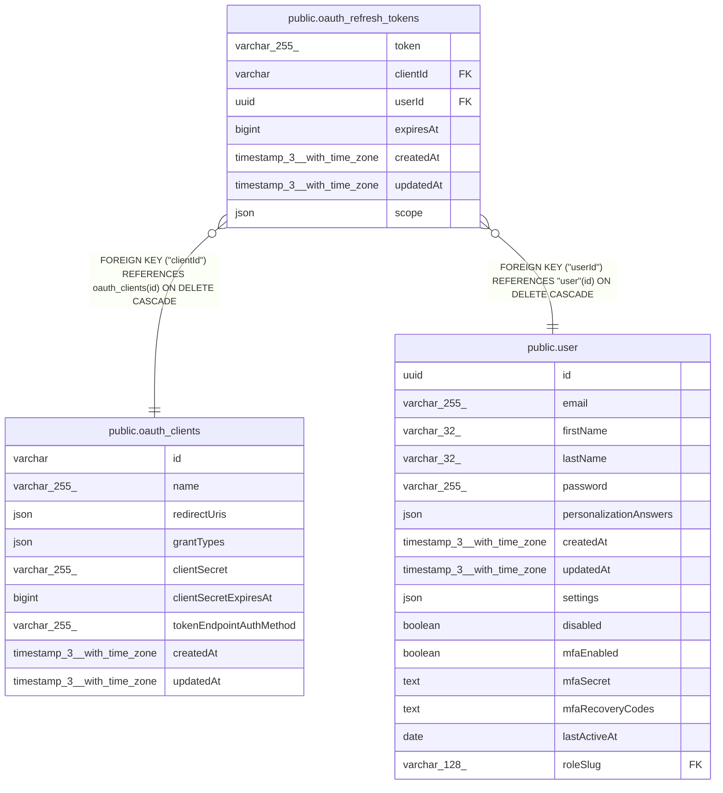

# public.oauth_refresh_tokens

## Columns

| Name | Type | Default | Nullable | Children | Parents | Comment |
| ---- | ---- | ------- | -------- | -------- | ------- | ------- |
| token | varchar(255) |  | false |  |  |  |
| clientId | varchar |  | false |  | [public.oauth_clients](public.oauth_clients.md) |  |
| userId | uuid |  | false |  | [public.user](public.user.md) |  |
| expiresAt | bigint |  | false |  |  | Unix timestamp in milliseconds |
| createdAt | timestamp(3) with time zone | CURRENT_TIMESTAMP(3) | false |  |  |  |
| updatedAt | timestamp(3) with time zone | CURRENT_TIMESTAMP(3) | false |  |  |  |
| scope | json | '["tool:listWorkflows","tool:getWorkflowDetails"]'::json | false |  |  | OAuth scopes granted for this refresh token |

## Constraints

| Name | Type | Definition |
| ---- | ---- | ---------- |
| oauth_refresh_tokens_clientId_not_null | n | NOT NULL "clientId" |
| oauth_refresh_tokens_createdAt_not_null | n | NOT NULL "createdAt" |
| oauth_refresh_tokens_expiresAt_not_null | n | NOT NULL "expiresAt" |
| oauth_refresh_tokens_scope_not_null | n | NOT NULL scope |
| oauth_refresh_tokens_token_not_null | n | NOT NULL token |
| oauth_refresh_tokens_updatedAt_not_null | n | NOT NULL "updatedAt" |
| oauth_refresh_tokens_userId_not_null | n | NOT NULL "userId" |
| FK_a699f3ed9fd0c1b19bc2608ac53 | FOREIGN KEY | FOREIGN KEY ("userId") REFERENCES "user"(id) ON DELETE CASCADE |
| FK_b388696ce4d8be7ffbe8d3e4b69 | FOREIGN KEY | FOREIGN KEY ("clientId") REFERENCES oauth_clients(id) ON DELETE CASCADE |
| PK_74abaed0b30711b6532598b0392 | PRIMARY KEY | PRIMARY KEY (token) |

## Indexes

| Name | Definition |
| ---- | ---------- |
| PK_74abaed0b30711b6532598b0392 | CREATE UNIQUE INDEX "PK_74abaed0b30711b6532598b0392" ON public.oauth_refresh_tokens USING btree (token) |

## Relations

---

> Generated by [tbls](https://github.com/k1LoW/tbls)
