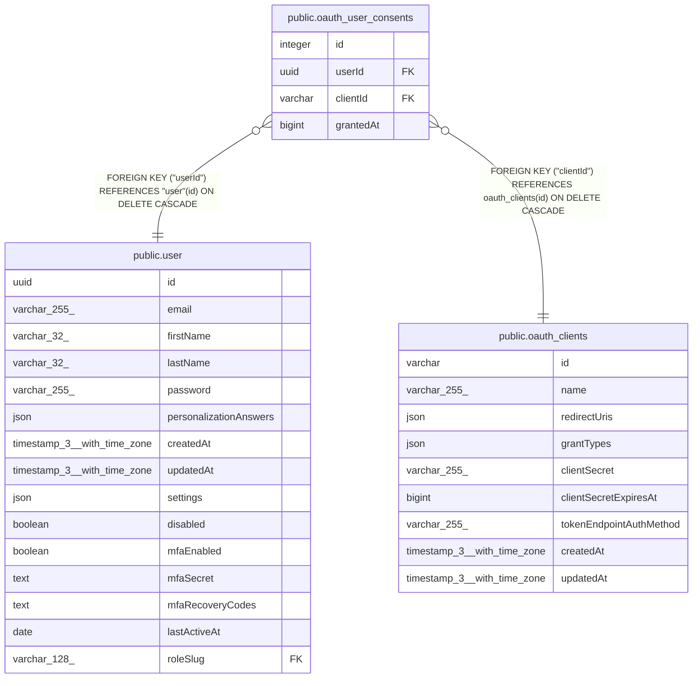

# public.oauth_user_consents

## Columns

| Name | Type | Default | Nullable | Children | Parents | Comment |
| ---- | ---- | ------- | -------- | -------- | ------- | ------- |
| id | integer |  | false |  |  |  |
| userId | uuid |  | false |  | [public.user](public.user.md) |  |
| clientId | varchar |  | false |  | [public.oauth_clients](public.oauth_clients.md) |  |
| grantedAt | bigint |  | false |  |  | Unix timestamp in milliseconds |

## Constraints

| Name | Type | Definition |
| ---- | ---- | ---------- |
| oauth_user_consents_clientId_not_null | n | NOT NULL "clientId" |
| oauth_user_consents_grantedAt_not_null | n | NOT NULL "grantedAt" |
| oauth_user_consents_id_not_null | n | NOT NULL id |
| oauth_user_consents_userId_not_null | n | NOT NULL "userId" |
| FK_21e6c3c2d78a097478fae6aaefa | FOREIGN KEY | FOREIGN KEY ("userId") REFERENCES "user"(id) ON DELETE CASCADE |
| FK_a651acea2f6c97f8c4514935486 | FOREIGN KEY | FOREIGN KEY ("clientId") REFERENCES oauth_clients(id) ON DELETE CASCADE |
| PK_85b9ada746802c8993103470f05 | PRIMARY KEY | PRIMARY KEY (id) |
| UQ_083721d99ce8db4033e2958ebb4 | UNIQUE | UNIQUE ("userId", "clientId") |

## Indexes

| Name | Definition |
| ---- | ---------- |
| PK_85b9ada746802c8993103470f05 | CREATE UNIQUE INDEX "PK_85b9ada746802c8993103470f05" ON public.oauth_user_consents USING btree (id) |
| UQ_083721d99ce8db4033e2958ebb4 | CREATE UNIQUE INDEX "UQ_083721d99ce8db4033e2958ebb4" ON public.oauth_user_consents USING btree ("userId", "clientId") |

## Relations

---

> Generated by [tbls](https://github.com/k1LoW/tbls)
