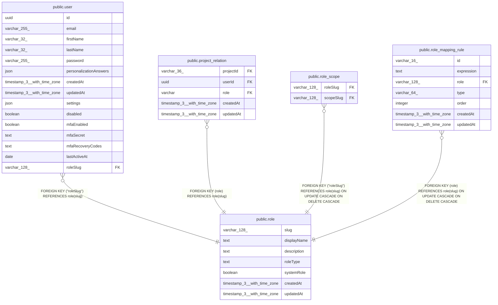

# public.role

## Columns

| Name | Type | Default | Nullable | Children | Parents | Comment |
| ---- | ---- | ------- | -------- | -------- | ------- | ------- |
| slug | varchar(128) |  | false | [public.user](public.user.md) [public.project_relation](public.project_relation.md) [public.role_scope](public.role_scope.md) [public.role_mapping_rule](public.role_mapping_rule.md) |  | Unique identifier of the role for example: "global:owner" |
| displayName | text |  | true |  |  | Name used to display in the UI |
| description | text |  | true |  |  | Text describing the scope in more detail of users |
| roleType | text |  | true |  |  | Type of the role, e.g., global, project, or workflow |
| systemRole | boolean | false | false |  |  | Indicates if the role is managed by the system and cannot be edited |
| createdAt | timestamp(3) with time zone | CURRENT_TIMESTAMP(3) | false |  |  |  |
| updatedAt | timestamp(3) with time zone | CURRENT_TIMESTAMP(3) | false |  |  |  |

## Constraints

| Name | Type | Definition |
| ---- | ---- | ---------- |
| role_createdAt_not_null | n | NOT NULL "createdAt" |
| role_slug_not_null | n | NOT NULL slug |
| role_systemRole_not_null | n | NOT NULL "systemRole" |
| role_updatedAt_not_null | n | NOT NULL "updatedAt" |
| PK_35c9b140caaf6da09cfabb0d675 | PRIMARY KEY | PRIMARY KEY (slug) |

## Indexes

| Name | Definition |
| ---- | ---------- |
| PK_35c9b140caaf6da09cfabb0d675 | CREATE UNIQUE INDEX "PK_35c9b140caaf6da09cfabb0d675" ON public.role USING btree (slug) |
| IDX_UniqueRoleDisplayName | CREATE UNIQUE INDEX "IDX_UniqueRoleDisplayName" ON public.role USING btree ("displayName") |

## Relations

---

> Generated by [tbls](https://github.com/k1LoW/tbls)
