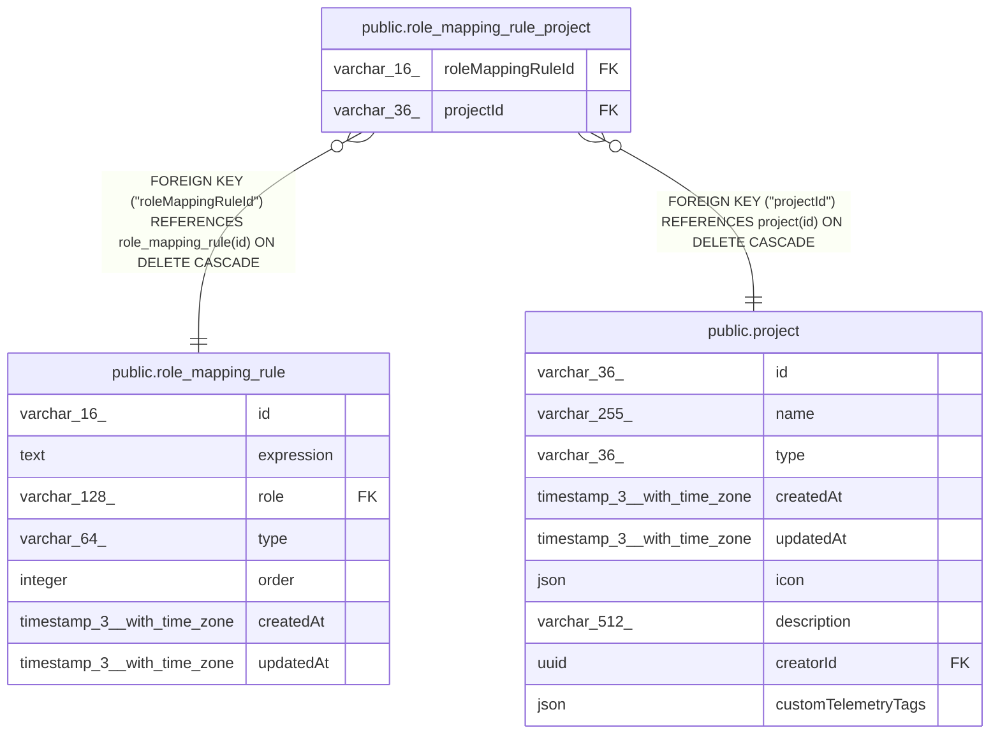

# public.role_mapping_rule_project

## Columns

| Name | Type | Default | Nullable | Children | Parents | Comment |
| ---- | ---- | ------- | -------- | -------- | ------- | ------- |
| roleMappingRuleId | varchar(16) |  | false |  | [public.role_mapping_rule](public.role_mapping_rule.md) |  |
| projectId | varchar(36) |  | false |  | [public.project](public.project.md) |  |

## Constraints

| Name | Type | Definition |
| ---- | ---- | ---------- |
| role_mapping_rule_project_projectId_not_null | n | NOT NULL "projectId" |
| role_mapping_rule_project_roleMappingRuleId_not_null | n | NOT NULL "roleMappingRuleId" |
| FK_35a78869286c65d9330d02b88f5 | FOREIGN KEY | FOREIGN KEY ("projectId") REFERENCES project(id) ON DELETE CASCADE |
| FK_dd7ce4dfa09e95b36a626bd9de3 | FOREIGN KEY | FOREIGN KEY ("roleMappingRuleId") REFERENCES role_mapping_rule(id) ON DELETE CASCADE |
| PK_198c5b5aea509d139274efcaf9a | PRIMARY KEY | PRIMARY KEY ("roleMappingRuleId", "projectId") |

## Indexes

| Name | Definition |
| ---- | ---------- |
| PK_198c5b5aea509d139274efcaf9a | CREATE UNIQUE INDEX "PK_198c5b5aea509d139274efcaf9a" ON public.role_mapping_rule_project USING btree ("roleMappingRuleId", "projectId") |
| IDX_35a78869286c65d9330d02b88f | CREATE INDEX "IDX_35a78869286c65d9330d02b88f" ON public.role_mapping_rule_project USING btree ("projectId") |

## Relations

---

> Generated by [tbls](https://github.com/k1LoW/tbls)
