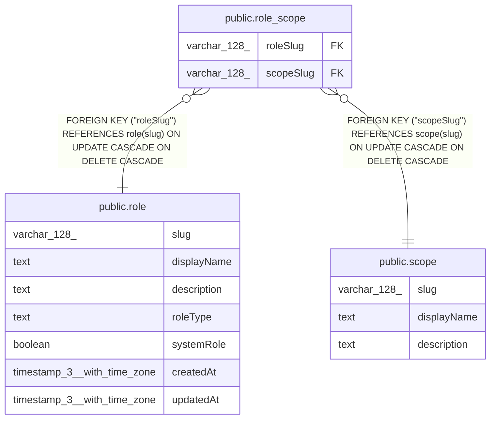

# public.role_scope

## Columns

| Name | Type | Default | Nullable | Children | Parents | Comment |
| ---- | ---- | ------- | -------- | -------- | ------- | ------- |
| roleSlug | varchar(128) |  | false |  | [public.role](public.role.md) |  |
| scopeSlug | varchar(128) |  | false |  | [public.scope](public.scope.md) |  |

## Constraints

| Name | Type | Definition |
| ---- | ---- | ---------- |
| role_scope_roleSlug_not_null | n | NOT NULL "roleSlug" |
| role_scope_scopeSlug_not_null | n | NOT NULL "scopeSlug" |
| FK_scope | FOREIGN KEY | FOREIGN KEY ("scopeSlug") REFERENCES scope(slug) ON UPDATE CASCADE ON DELETE CASCADE |
| FK_role | FOREIGN KEY | FOREIGN KEY ("roleSlug") REFERENCES role(slug) ON UPDATE CASCADE ON DELETE CASCADE |
| PK_role_scope | PRIMARY KEY | PRIMARY KEY ("roleSlug", "scopeSlug") |

## Indexes

| Name | Definition |
| ---- | ---------- |
| PK_role_scope | CREATE UNIQUE INDEX "PK_role_scope" ON public.role_scope USING btree ("roleSlug", "scopeSlug") |
| IDX_role_scope_scopeSlug | CREATE INDEX "IDX_role_scope_scopeSlug" ON public.role_scope USING btree ("scopeSlug") |

## Relations

---

> Generated by [tbls](https://github.com/k1LoW/tbls)
