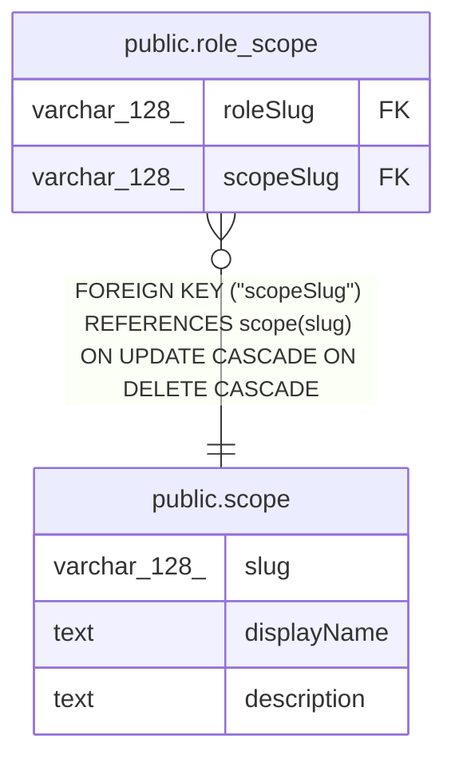

# public.scope

## Columns

| Name | Type | Default | Nullable | Children | Parents | Comment |
| ---- | ---- | ------- | -------- | -------- | ------- | ------- |
| slug | varchar(128) |  | false | [public.role_scope](public.role_scope.md) |  | Unique identifier of the scope for example: "project:create" |
| displayName | text |  | true |  |  | Name used to display in the UI |
| description | text |  | true |  |  | Text describing the scope in more detail of users |

## Constraints

| Name | Type | Definition |
| ---- | ---- | ---------- |
| scope_slug_not_null | n | NOT NULL slug |
| PK_bfc45df0481abd7f355d6187da1 | PRIMARY KEY | PRIMARY KEY (slug) |

## Indexes

| Name | Definition |
| ---- | ---------- |
| PK_bfc45df0481abd7f355d6187da1 | CREATE UNIQUE INDEX "PK_bfc45df0481abd7f355d6187da1" ON public.scope USING btree (slug) |

## Relations

---

> Generated by [tbls](https://github.com/k1LoW/tbls)
