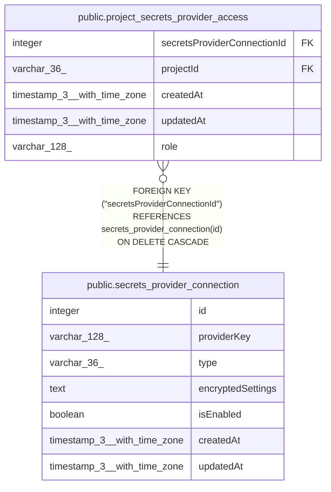

# public.secrets_provider_connection

## Columns

| Name | Type | Default | Nullable | Children | Parents | Comment |
| ---- | ---- | ------- | -------- | -------- | ------- | ------- |
| id | integer |  | false | [public.project_secrets_provider_access](public.project_secrets_provider_access.md) |  |  |
| providerKey | varchar(128) |  | false |  |  |  |
| type | varchar(36) |  | false |  |  | Type of secrets provider. Possible values: awsSecretsManager, gcpSecretsManager, vault, azureKeyVault, infisical |
| encryptedSettings | text |  | false |  |  |  |
| isEnabled | boolean | false | false |  |  |  |
| createdAt | timestamp(3) with time zone | CURRENT_TIMESTAMP(3) | false |  |  |  |
| updatedAt | timestamp(3) with time zone | CURRENT_TIMESTAMP(3) | false |  |  |  |

## Constraints

| Name | Type | Definition |
| ---- | ---- | ---------- |
| secrets_provider_connection_createdAt_not_null | n | NOT NULL "createdAt" |
| secrets_provider_connection_encryptedSettings_not_null | n | NOT NULL "encryptedSettings" |
| secrets_provider_connection_id_not_null | n | NOT NULL id |
| secrets_provider_connection_isEnabled_not_null | n | NOT NULL "isEnabled" |
| secrets_provider_connection_providerKey_not_null | n | NOT NULL "providerKey" |
| secrets_provider_connection_type_not_null | n | NOT NULL type |
| secrets_provider_connection_updatedAt_not_null | n | NOT NULL "updatedAt" |
| PK_4350ae85e76f9ba7df1370acb5d | PRIMARY KEY | PRIMARY KEY (id) |

## Indexes

| Name | Definition |
| ---- | ---------- |
| PK_4350ae85e76f9ba7df1370acb5d | CREATE UNIQUE INDEX "PK_4350ae85e76f9ba7df1370acb5d" ON public.secrets_provider_connection USING btree (id) |
| IDX_secrets_provider_connection_providerKey | CREATE UNIQUE INDEX "IDX_secrets_provider_connection_providerKey" ON public.secrets_provider_connection USING btree ("providerKey") |

## Relations

---

> Generated by [tbls](https://github.com/k1LoW/tbls)
