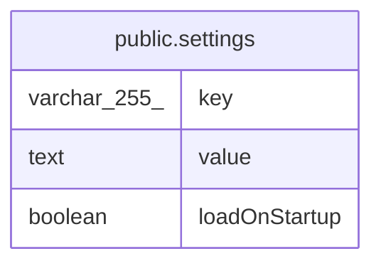

# public.settings

## Columns

| Name | Type | Default | Nullable | Children | Parents | Comment |
| ---- | ---- | ------- | -------- | -------- | ------- | ------- |
| key | varchar(255) |  | false |  |  |  |
| value | text |  | false |  |  |  |
| loadOnStartup | boolean | false | false |  |  |  |

## Constraints

| Name | Type | Definition |
| ---- | ---- | ---------- |
| settings_key_not_null | n | NOT NULL key |
| settings_loadOnStartup_not_null | n | NOT NULL "loadOnStartup" |
| settings_value_not_null | n | NOT NULL value |
| PK_dc0fe14e6d9943f268e7b119f69ab8bd | PRIMARY KEY | PRIMARY KEY (key) |

## Indexes

| Name | Definition |
| ---- | ---------- |
| PK_dc0fe14e6d9943f268e7b119f69ab8bd | CREATE UNIQUE INDEX "PK_dc0fe14e6d9943f268e7b119f69ab8bd" ON public.settings USING btree (key) |

## Relations

---

> Generated by [tbls](https://github.com/k1LoW/tbls)
