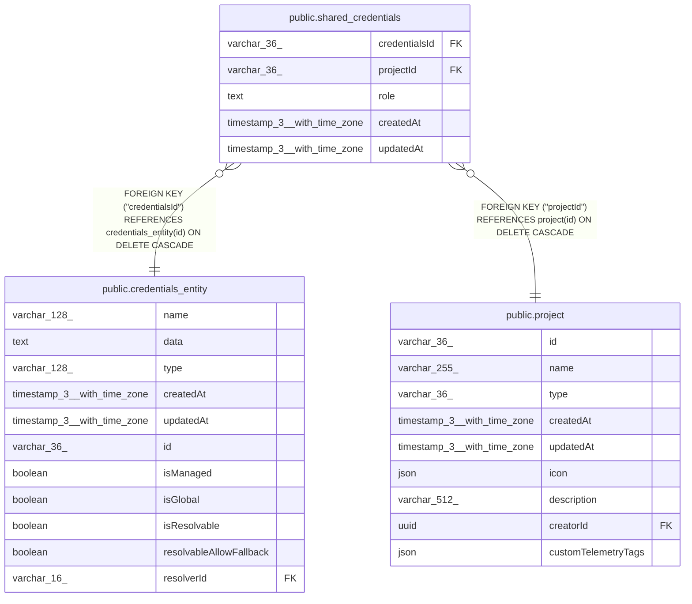

# public.shared_credentials

## Columns

| Name | Type | Default | Nullable | Children | Parents | Comment |
| ---- | ---- | ------- | -------- | -------- | ------- | ------- |
| credentialsId | varchar(36) |  | false |  | [public.credentials_entity](public.credentials_entity.md) |  |
| projectId | varchar(36) |  | false |  | [public.project](public.project.md) |  |
| role | text |  | false |  |  |  |
| createdAt | timestamp(3) with time zone | CURRENT_TIMESTAMP(3) | false |  |  |  |
| updatedAt | timestamp(3) with time zone | CURRENT_TIMESTAMP(3) | false |  |  |  |

## Constraints

| Name | Type | Definition |
| ---- | ---- | ---------- |
| shared_credentials_2_createdAt_not_null | n | NOT NULL "createdAt" |
| shared_credentials_2_credentialsId_not_null | n | NOT NULL "credentialsId" |
| shared_credentials_2_projectId_not_null | n | NOT NULL "projectId" |
| shared_credentials_2_role_not_null | n | NOT NULL role |
| shared_credentials_2_updatedAt_not_null | n | NOT NULL "updatedAt" |
| FK_416f66fc846c7c442970c094ccf | FOREIGN KEY | FOREIGN KEY ("credentialsId") REFERENCES credentials_entity(id) ON DELETE CASCADE |
| FK_812c2852270da1247756e77f5a4 | FOREIGN KEY | FOREIGN KEY ("projectId") REFERENCES project(id) ON DELETE CASCADE |
| PK_8ef3a59796a228913f251779cff | PRIMARY KEY | PRIMARY KEY ("credentialsId", "projectId") |

## Indexes

| Name | Definition |
| ---- | ---------- |
| PK_8ef3a59796a228913f251779cff | CREATE UNIQUE INDEX "PK_8ef3a59796a228913f251779cff" ON public.shared_credentials USING btree ("credentialsId", "projectId") |

## Relations

---

> Generated by [tbls](https://github.com/k1LoW/tbls)
