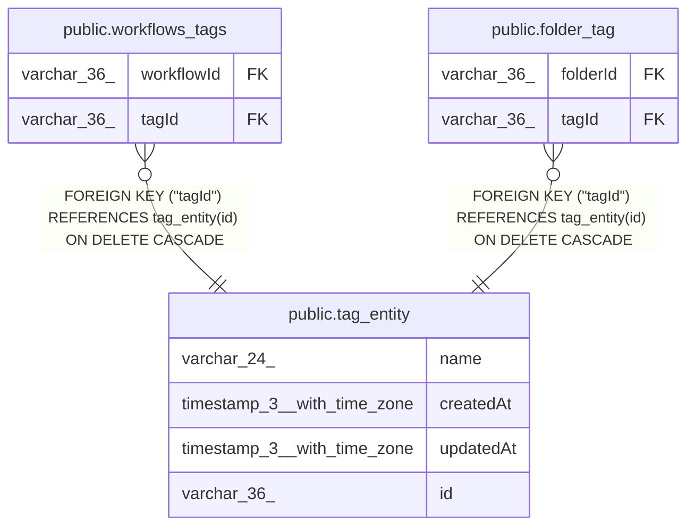

# public.tag_entity

## Columns

| Name | Type | Default | Nullable | Children | Parents | Comment |
| ---- | ---- | ------- | -------- | -------- | ------- | ------- |
| name | varchar(24) |  | false |  |  |  |
| createdAt | timestamp(3) with time zone | CURRENT_TIMESTAMP(3) | false |  |  |  |
| updatedAt | timestamp(3) with time zone | CURRENT_TIMESTAMP(3) | false |  |  |  |
| id | varchar(36) |  | false | [public.workflows_tags](public.workflows_tags.md) [public.folder_tag](public.folder_tag.md) |  |  |

## Constraints

| Name | Type | Definition |
| ---- | ---- | ---------- |
| tag_entity_createdAt_not_null | n | NOT NULL "createdAt" |
| tag_entity_id_not_null1 | n | NOT NULL id |
| tag_entity_name_not_null | n | NOT NULL name |
| tag_entity_updatedAt_not_null | n | NOT NULL "updatedAt" |
| tag_entity_pkey | PRIMARY KEY | PRIMARY KEY (id) |

## Indexes

| Name | Definition |
| ---- | ---------- |
| idx_812eb05f7451ca757fb98444ce | CREATE UNIQUE INDEX idx_812eb05f7451ca757fb98444ce ON public.tag_entity USING btree (name) |
| pk_tag_entity_id | CREATE UNIQUE INDEX pk_tag_entity_id ON public.tag_entity USING btree (id) |
| tag_entity_pkey | CREATE UNIQUE INDEX tag_entity_pkey ON public.tag_entity USING btree (id) |

## Relations

---

> Generated by [tbls](https://github.com/k1LoW/tbls)
